# 回授控制:PID 與 LQR,以及叉車搬運車怎麼用它們

一台叉車要沿著路徑走到棧板前、把貨叉插進 100 mm 高的叉孔裡,中間每一毫秒都在回答同一個問題:**現在的狀態離我要的差多少,馬達該出多少力**。回答這個問題的東西叫**控制器(controller)**,而工程上真正在用的只有兩大類寫法——PID 與 LQR。

這兩者常被講成「一個簡單一個進階」,那是誤導。它們的差別在**手上有沒有系統模型**:PID 只看一條誤差曲線,不知道車長什麼樣;LQR 拿著 `ẋ = Ax + Bu` 這個模型,能算出「現在打方向盤,兩秒後橫向偏差會變多少」。有模型就能做取捨,而取捨要寫成一個代價函數:

$$ J = \int_0^{\infty} \left( x^{\mathsf T} Q x + u^{\mathsf T} R u \right) \mathrm{d}t \qquad\Longrightarrow\qquad u = -Kx $$

這篇分兩半。前半把這兩條式子從根本逼出來:為什麼代價是**二次型**、為什麼最佳解一定是狀態的**線性函數**、`K` 從哪個方程解出來、它保證什麼又不保證什麼。後半把它落到叉車與搬運車:舵輪運動學、四層控制迴路怎麼分工、橫向誤差的狀態向量怎麼定、倒車為什麼會不穩、載重從空車變滿載時增益要不要換、以及什麼時候 LQR 不夠得換 MPC。

> 前置:[下位機運動控制](../10-core/20-firmware/low-level-control.md)(PID 三項的基本直覺、積分 windup)、[機器人動力學](robot-dynamics.md)(§9 的 Lyapunov 能量論證,本篇 §6 直接接續)。線性代數(矩陣乘法、特徵值、正定)與大一微積分即可,其餘從零推。
> 延伸:[路徑規劃與軌跡(Nav2)](../10-core/30-navigation/path-planning.md)(區域控制器 RPP/DWB/MPPI 的定位)、[路徑平滑與軌跡生成](../10-core/30-navigation/path-smoothing-and-trajectory.md)(本篇追的參考軌跡從哪來)、[在 Gazebo 做叉車搬運](../50-physical-ai/project-forklift-rmf-gazebo.md)(同一套模型的模擬版)。

---

# Part A — 數學

## 1. 根本問題:為什麼一定要回授

先看不用回授會怎樣。

一台電動叉車,馬達給定電壓 `V`,車就會動。想走 1 m/s,查一下規格表「12 V 對應 1 m/s」,那就給 12 V——這叫**開環(open loop)**:算好指令送出去,不管結果。

開環在什麼條件下才對?要求**從輸入到輸出的映射完全已知且不變**。叉車正好每一條都不成立:

| 變的東西 | 變多少 | 對「12 V → 1 m/s」的影響 |
|---|---|---|
| 載重 | 空車 2 t、滿載 3.5 t | 同樣電壓,滿載加速慢一半以上 |
| 地面 | 環氧地坪 / 濕滑 / 接縫 | 滾動阻力可差數倍 |
| 坡度 | 裝卸區常有 2–5% 引道 | 重力分量直接吃掉牽引力 |
| 電池 | 滿電 50 V → 低電 42 V | 同樣占空比,實際電壓少 16% |
| 馬達溫度 | 冷車 25°C → 連續作業 90°C | 繞組電阻升高,同電壓電流變小 |

<p align="center">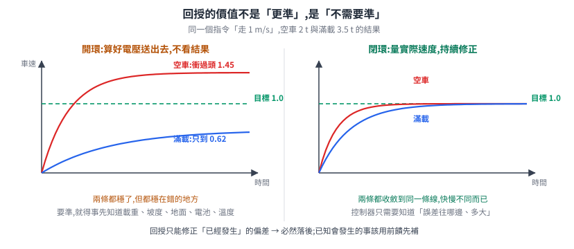</p>

**回授的價值不是「更準」,是「不需要準」**。閉環控制器不必知道現在載了多重、地板多滑,它只需要知道**誤差的符號與大小**:太慢就加、太快就減。整條從輸入到輸出的複雜關係,被壓縮成一個問題——「往哪個方向調」。

這也劃出了回授的**能力邊界**:它只能修正「已經發生」的偏差,所以必然落後。要走得更好,得把「已知會發生的事」用前饋(feedforward)先補上去——這正是 [computed torque](robot-dynamics.md#9-動力學拿來控制computed-torque-與-pd--重力補償) 在做的事。**前饋處理已知,回授處理未知**,兩者不互相取代。

於是問題變成:誤差已經量到了,**該怎麼把誤差變成指令**?這是整篇要回答的唯一問題,PID 與 LQR 是兩個不同的答案。

---

## 2. PID:三項各自從哪裡長出來

PID 的形式大家都會寫:

$$ u(t) = K_p\, e(t) + K_i \int_0^t e(\tau)\,\mathrm{d}\tau + K_d\, \frac{\mathrm{d}e(t)}{\mathrm{d}t} $$

但「P 看現在、I 看過去、D 看未來」是助記,不是理由。逐項問「不加它會缺什麼」。

<p align="center">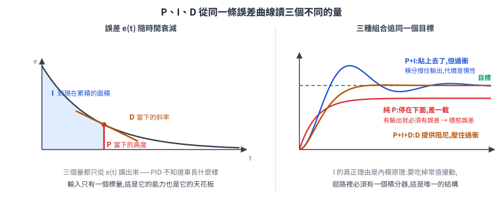</p>

### 2.1 P 項:唯一不能省的那一項

`u = K_p e` 是最小的可用回授:誤差有多大就修多大,方向自動對(誤差為正就加、為負就減)。少了它,控制器對「當下差多少」完全沒有反應。

它的問題出在**輸出與誤差被綁死**。要有輸出,就必須有誤差。

### 2.2 I 項:內模原理才是真正的理由

叉車停在 3% 的坡上要維持不動,馬達**必須持續出一個固定力矩**去抵銷重力分量。純 P 控制器怎麼提供這個力矩?只能靠「留著一段誤差」換,於是車會往下滑一點點才停住——這段擦不掉的差就是**穩態誤差(steady-state error)**。

[下位機那篇 §7.3](../10-core/20-firmware/low-level-control.md#73-那-pid-需要哪些知識) 已經從這個角度推過 I 項。這裡補上更一般的版本,它同時回答「什麼擾動需要幾個積分器」:

> **內模原理(Internal Model Principle)**:要讓某一類訊號的穩態誤差歸零,控制迴路內部**必須包含產生那類訊號的模型**。

常值擾動(坡度、固定摩擦、秤重偏差)的生成模型是一個**積分器** `1/s`——一個積分器的輸出可以在輸入為零時保持定值。所以迴路裡放一個積分器,常值擾動就被完全吸收。這不是巧合,是**唯一**能做到的結構。

推論很實用:

| 要對付的東西 | 需要的積分器數 | 叉車上的例子 |
|---|---|---|
| 常值擾動 / 定值目標 | 1(標準 I 項) | 坡度、摩擦、定速行駛 |
| 斜坡目標(等速變化) | 2 | 等速上升、等速跟車;只有一個積分器會留固定落後量 |
| 週期性擾動(頻率 ω 已知) | 對應 `1/(s² + ω²)` 的共振項 | 輪子偏心造成的週期性速度漣漪(重複控制) |

第二列有個容易數錯的地方:**積分器不一定要來自控制器,受控體本身可能就內建一個**。貨叉正是這種情況——液壓比例閥的開度決定的是**流量**,也就是缸體的**速度**,而速度再積分一次才是高度。所以「閥開度 → 高度」這條路本身就是一個積分器。

於是同一顆 PID 接在不同地方,結論相反:

- **位置環直接控閥開度**:受控體 1 個 + PID 的 I 項 1 個 = 兩個積分器,等速上升的穩態誤差理論上為零。
- **位置環對一個已閉合的速度伺服下指令**(串級,§8 的架構):對位置環而言內層已經做好「給速度就照走」,受控體不再貢獻積分器,PID 的 I 項是全迴路唯一的一個——這時等速上升就會**留下固定的高度落差**。

判斷方式永遠是數「從控制器輸出到量測值之間總共經過幾個積分器」,而不是數控制器裡有幾個 I 項。真的碰上落差時,解法也不是把 `K_i` 拉大(那只會震盪),而是**把速度前饋加上去**,讓回授只需要處理常值等級的殘差。

### 2.3 積分器的代價:windup 與三種解法

積分器一旦裝上去,就帶來一個結構性的副作用:**它會記住輸出飽和期間的一切**。

貨叉被卡住、車輪陷進地面接縫,誤差持續存在但輸出已經 100%,積分項卻照樣累加。等障礙排除,那個累積到天上的積分值要花很久才「洩」回來,期間輸出一直滿檔——車會衝過頭。

三種標準解法,差別在「飽和期間拿積分怎麼辦」:

| 做法 | 機制 | 適用 |
|---|---|---|
| **條件積分(conditional integration)** | 偵測到輸出飽和就暫停累加 | 最簡單,MCU 上首選 |
| **積分限幅(clamping)** | 把積分項本身夾在 `[−I_max, I_max]` | 簡單,但限值要調 |
| **反算(back-calculation)** | 把「指令值 − 實際飽和值」的差額,以增益 `1/T_t` 回饋去扣減積分 | 退飽和最平順,工業 PID 的標準做法 |

反算的形式:`İ = K_i e + (u_sat − u)/T_t`。飽和時第二項為負,自動把積分往回拉;不飽和時 `u_sat = u`,第二項消失,退化成一般的 I 項。**同一段程式碼同時處理兩種情況**,不需要 if。

`T_t` 叫**追蹤時間常數**,決定「退飽和要花多久」:取小則積分被拉回來得快,但飽和量測上的雜訊也跟著被放大;取大則退飽和慢,windup 的症狀還在。常見起手值是與積分時間 `K_p/K_i` 同數量級。

### 2.4 D 項:預測,以及它為什麼在實機上常被關掉

`K_d · de/dt` 等於用當下的變化率做**一階外插**:誤差正在快速縮小,就提前收力,免得衝過頭。它是唯一能提供**阻尼**的項。

但微分在數位系統上有兩個具體的病:

**病一:放大高頻噪聲。** 對訊號 `n·sin(ωt)` 微分得 `nω·cos(ωt)`——振幅被乘上 `ω`。(這裡的 `ω` 是訊號的**角頻率**,和 §7 之後表示車體角速度的 `ω` 不是同一個量,只是兩個領域碰巧共用同一個希臘字母。)編碼器量測裡 100 Hz 的抖動,微分後被放大 100 倍(相對於 1 Hz 的真實訊號)。實務上一律加低通,用**濾波微分**:

$$ D(s) = K_d \frac{s}{1 + s/N} $$

`N` 通常取 8–20:低頻照常微分,高於 `N` 倍轉折頻率之後增益封頂在 `K_d N`,不再往上爬。

**病二:微分踢(derivative kick)。** 目標值階躍變化時(操作員按下「移動到 2 m」),`e = r − y` 瞬間跳一大格,`de/dt` 在那一瞬間是脈衝,輸出會噴出一個尖峰。解法是**只對量測值微分,不對誤差微分**:

$$ u = K_p e + K_i \!\int\! e \,\mathrm{d}t - K_d \frac{\mathrm{d}y}{\mathrm{d}t} $$

因為 `de/dt = dr/dt − dy/dt`,而目標值的變化率本來就不該進微分項(目標怎麼跳是人的事,不是系統的動態)。負號來自 `e` 對 `y` 的符號。

底盤速度環實務上多半只用 **PI**:速度訊號本身已經是位置的微分(來自編碼器計數),再微分一次噪聲就壓不住了,而阻尼由機械摩擦與馬達電氣時間常數自然提供。

### 2.5 離散化:MCU 上實際跑的是哪一條式子

MCU 每 `T` 秒執行一次,積分與微分都得換成差分。積分用後向矩形、微分用後向差分,是最常見也最穩的組合:

$$ I_k = I_{k-1} + K_i\,T\,e_k, \qquad D_k = K_d\,\frac{y_k - y_{k-1}}{T} $$

三件實務上真的會出事的細節:

1. **`T` 必須是實際的間隔,不是名目值。** 如果控制迴路被中斷延遲、有時 5 ms 有時 7 ms,而程式碼寫死 `T = 0.005`,積分與微分的增益就會隨機浮動。要嘛用硬體計時器保證等間隔,要嘛量測實際 `Δt` 代進去。
2. **增益要吸收 `T`。** `K_i·T` 一起存成一個常數,調參時改的是那個常數;取樣週期改了(例如從 200 Hz 改 500 Hz)而增益沒跟著換算,整組參數就失效。
3. **積分用增量式累加,不要每次重算總和。** 前者是 O(1) 且不需要保存歷史,後者在定點數上還會溢位。

---

## 3. 從一條誤差到一個狀態向量

PID 到這裡已經很完整了。它的結構性限制也正好在這裡浮現:**它的輸入只有一個標量 `e`**。

一台叉車在追一條路徑,至少有兩個誤差同時存在:**橫向偏差** `e_y`(車在路徑左邊還是右邊多少公尺)與**航向偏差** `e_θ`(車頭方向與路徑切線差幾度)。而它們**強烈耦合**:要修正橫向偏差,唯一的手段是轉向,轉向立刻製造航向偏差;等橫向對上了,航向已經歪掉,車會穿越過去再繞回來。

兩個獨立的 PID 各管一個,會彼此打架——因為兩者都不知道對方存在。要處理這種情況,得先換一套描述系統的語言。

### 3.1 狀態:能把未來與過去切開的最小資訊

> **狀態(state)** `x` 是這樣一組變數:知道**此刻的 `x`**,加上**從此刻起的輸入 `u(t)`**,就足以決定未來所有的行為;在此之前發生過什麼,完全不必知道。

這個定義是操作性的,不是哲學的。「最小」是關鍵:多帶的資訊沒有壞處但沒有必要,少帶就會發現「同樣的 `x` 和同樣的 `u`,系統有時這樣走有時那樣走」——那表示還有沒抓到的變數。

以叉車的橫向控制為例,`x = [e_y, ė_y, e_θ, ė_θ]ᵀ` 四維。為什麼要帶上變化率?因為只知道「現在偏左 5 cm」不足以決定未來——正在往回收和正在繼續偏出去,是完全不同的兩件事。

### 3.2 線性系統:ẋ = Ax + Bu

系統的演化寫成一階微分方程組:

$$ \dot{x} = A x + B u, \qquad y = C x $$

- `A`(n×n)**系統矩陣**:沒有任何輸入時,狀態自己怎麼演化。`A` 的**特徵值就是系統的極點**——實部為正代表那個方向會指數發散。
- `B`(n×m)**輸入矩陣**:控制輸入怎麼推動狀態。`B` 決定了「你能推的方向」。
- `C` **輸出矩陣**:哪些狀態量測得到。

叉車顯然不是線性的(`ẋ = v cos θ` 裡有三角函數)。線性模型從**在工作點附近取一階 Taylor 展開**來:

$$ A = \left.\frac{\partial f}{\partial x}\right|_{x_0, u_0}, \qquad B = \left.\frac{\partial f}{\partial u}\right|_{x_0, u_0} $$

也就是 Jacobian。這帶來一個必須誠實面對的限制:**`A`、`B` 只在工作點附近有效**。叉車以 1 m/s 巡航時線性化出來的模型,在 0.2 m/s 對位時是錯的——§11 的增益排程就是為了這件事而存在。

---

## 4. 代價函數:為什麼一定是 xᵀQx + uᵀRu

有了模型,「控制得好」需要被定義成一個可以最小化的數字。這一節回答:為什麼那個數字長成二次型的樣子。

### 4.1 二次型不是選擇,是必然

先列出代價函數 `L(x, u)` 必須滿足的條件,一條都不多:

1. **在目標點代價為零**:`L(0, 0) = 0`。
2. **代價非負**:`L ≥ 0`。偏離目標不能有好處。
3. **對稱**:偏左 10 cm 與偏右 10 cm 一樣糟。
4. **二階連續可微**:要能展開到二次項,下面的論證才談得上。

現在把 `L` 在原點做 Taylor 展開:

$$ L(x) = \underbrace{L(0)}_{= 0 \;(\text{條件 1})} + \underbrace{\nabla L(0)^{\mathsf T} x}_{= 0 \;(\text{原點是最小,梯度必為零})} + \frac{1}{2} x^{\mathsf T} \nabla^2 L(0)\, x + O(\|x\|^3) $$

前兩項被條件強制歸零。**剩下最低階的非零項,就是二次項**。(`∇²L(0)` 半正定不是額外假設,它是「原點是最小點」的必然結果。)

<p align="center">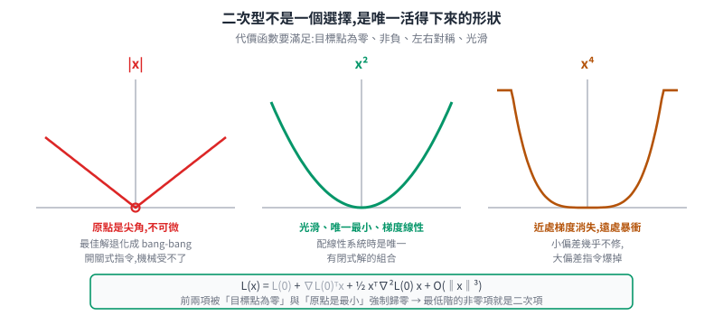</p>

所以二次型不是「一個好用的選擇」,而是**任何滿足上述四條的代價函數,在目標點附近的普適近似**。用 `|x|` 會在原點不可微(最佳解退化成 bang-bang 開關式控制,對機械是災難);用 `x⁴` 則近處梯度消失(小偏差幾乎不修)、遠處懲罰暴衝。

還有一個更現實的理由:**線性系統 + 二次代價,是唯一有閉式解的組合**。這是它統治工程界的真正原因——換掉任何一邊,就得靠數值最佳化線上求解(那條路叫 MPC,見 §12)。

### 4.2 Q 與 R 各自在秤什麼

$$ J = \int_0^{\infty} \big( \underbrace{x^{\mathsf T} Q x}_{\text{偏差有多糟}} + \underbrace{u^{\mathsf T} R u}_{\text{出力有多貴}} \big)\, \mathrm{d}t $$

把矩陣展開就看得懂了。`Q` 取對角時:

$$ x^{\mathsf T} Q x = q_{11} x_1^2 + q_{22} x_2^2 + \cdots + q_{nn} x_n^2 $$

**每個對角元素就是那個狀態量的權重**。叉車的 `Q = diag(q_y, q_{\dot y}, q_θ, q_{\dot θ})`:把 `q_y` 調大,控制器就更在意橫向偏差、願意用更大的方向盤動作去壓它。

非對角元素 `q_{ij}` 懲罰的是**乘積** `x_i x_j`,也就是「這兩個誤差同號時額外糟」。實務上很少用,因為難以直覺調整。

`R` 同理,`u = [δ]`(轉向角)時 `R` 是純量:`R` 大就是「方向盤請少動一點」。

### 4.3 兩個容易踩的坑

**坑一:R 必須嚴格正定,不能只是半正定。**

如果 `R` 有一個零方向,那個方向的控制輸入就**完全免費**。最佳解會用無限大的增益去瞬間消除誤差——數學上 `K → ∞`,物理上馬達會燒掉。`R > 0` 這個條件不是技術細節,它就是「出力要付代價」這件事的數學形式。而 `Q` 只需要半正定(允許某些狀態不被懲罰)。

**坑二:Q 與 R 的絕對值沒有意義,比值才有。**

把 `Q` 和 `R` 同時乘以 10,`J` 變成 10 倍,但**最小化 `J` 的那個 `u` 完全不變**,解出來的 `K` 一模一樣。所以調參只有一個自由度方向:`Q/R` 的相對大小。

$$ \frac{Q}{R} \uparrow \;\Rightarrow\; \text{反應快、控制力大、可能過衝} \qquad \frac{Q}{R} \downarrow \;\Rightarrow\; \text{溫和省力、收斂慢} $$

起手值用 **Bryson 法則**:把每個量除以它的容許上限,再平方倒數——

$$ q_{ii} = \frac{1}{(x_{i,\max})^2}, \qquad r_{jj} = \frac{1}{(u_{j,\max})^2} $$

意思是「各個量都用掉自己額度的多少比例」。叉車橫向誤差最多容忍 0.05 m、轉向角最多 1.2 rad,那 `q_y = 1/0.05² = 400`、`r = 1/1.2² ≈ 0.69`。量綱不同的東西(公尺、弧度)因此被正規化到同一個尺度上,可以相加。這是起點,不是終點——之後照實測結果調。

---

## 5. u = −Kx:最佳解為什麼是狀態的線性函數

現在要解的問題是:

$$ \min_{u(\cdot)} \int_0^{\infty} \left( x^{\mathsf T} Q x + u^{\mathsf T} R u \right) \mathrm{d}t \quad \text{s.t.} \quad \dot{x} = Ax + Bu $$

這是對**一整條無限長的函數** `u(t)` 做最佳化——無窮多個自由度。直接硬解不可行,得換一個角度。

### 5.1 動態規劃:把無窮維問題壓成一個代數方程

關鍵想法(Bellman):不要問「整條最佳軌跡長什麼樣」,問「**從現在這個狀態出發,剩下要付的最小總代價是多少**」。把它定義成一個函數:

$$ V(x) \;=\; \min_{u(\cdot)} \int_{t}^{\infty} \left( x^{\mathsf T} Q x + u^{\mathsf T} R u \right) \mathrm{d}\tau \qquad (\text{value function,成本-to-go}) $$

`V` 只是狀態的函數,不含時間(因為系統是時不變的、時域無限長,從任何時刻看出去的問題長得一樣)。

最佳性原理說:最佳決策 = 「這一瞬間付的代價」+「走一小步之後、從新狀態再出發的最小代價」,兩者之和最小。寫成微分形式就是 **HJB 方程**:

$$ 0 = \min_{u} \left[ x^{\mathsf T} Q x + u^{\mathsf T} R u + \nabla V(x)^{\mathsf T} (Ax + Bu) \right] $$

### 5.2 猜一個形式,然後驗證它自洽

`V` 是什麼形狀?用 §4.1 的同一個論證:`V(0) = 0`(已經在目標點,不用再付)、`V ≥ 0`、對稱、光滑。所以猜:

$$ V(x) = x^{\mathsf T} P x, \qquad P = P^{\mathsf T} \succ 0 $$

(`P ≻ 0` 讀作 `P` **正定**:對任何非零的 `x`,`xᵀPx` 都是正數。把它想成「這個矩陣代表的碗,開口一律向上」。)

梯度 `∇V = 2Px`。代進 HJB:

$$ 0 = \min_u \left[ x^{\mathsf T} Q x + u^{\mathsf T} R u + 2 x^{\mathsf T} P (Ax + Bu) \right] $$

中括號裡對 `u` 是個**二次函數**,而且因為 `R > 0`,它是**嚴格凸**的——形狀像個碗,任兩點的連線都在函數上方,所以只有一個最低點。對 `u` 求導設為零就找得到:

$$ \frac{\partial}{\partial u}\left[ u^{\mathsf T} R u + 2x^{\mathsf T} P B u \right] = 2Ru + 2B^{\mathsf T} P x = 0 $$

(這裡用到兩條矩陣微積分規則:`∂(uᵀRu)/∂u = 2Ru`(`R` 對稱時成立),以及 `∂(xᵀPBu)/∂u = BᵀPx`。它們就是純量的 `d(au²)/du = 2au` 與 `d(bu)/du = b` 搬到向量上的版本——對向量求導的結果仍是同維度的向量,每一格是對該分量的偏導數。)

$$ \boxed{\;u^{*} = -R^{-1} B^{\mathsf T} P\, x \;\equiv\; -K x, \qquad K = R^{-1} B^{\mathsf T} P\;} $$

**這就是 `u = −Kx` 的來源。** 它不是一個被假設的控制器結構,是**推導的結果**:對線性系統配二次代價,最佳控制律必然是狀態的線性函數。負號來自「往降低代價的方向走」。`R⁻¹` 在這裡的角色也清楚了——控制越貴(`R` 越大),增益越小。

### 5.3 代回去:Riccati 方程

把 `u* = −R⁻¹BᵀPx` 代回 HJB(此時 min 已經取到,可以拿掉):

$$ x^{\mathsf T} Q x + x^{\mathsf T} P B R^{-1} B^{\mathsf T} P x + 2 x^{\mathsf T} P A x - 2 x^{\mathsf T} P B R^{-1} B^{\mathsf T} P x = 0 $$

接著要把 `2xᵀPAx` 寫成對稱的形式。用的是一個小技巧(§6.2 還會再用一次):`xᵀPAx` 是個 **1×1 的純量**,而純量等於自己的轉置,所以

$$ x^{\mathsf T} P A x = (x^{\mathsf T} P A x)^{\mathsf T} = x^{\mathsf T} A^{\mathsf T} P^{\mathsf T} x = x^{\mathsf T} A^{\mathsf T} P x $$

(最後一步用 `P` 對稱)。兩種寫法都對,把它們相加除以二,就得到 `2xᵀPAx = xᵀ(PA + AᵀP)x`。合併同類項:

$$ x^{\mathsf T} \left[ A^{\mathsf T} P + P A - P B R^{-1} B^{\mathsf T} P + Q \right] x = 0 $$

這要對**所有** `x` 成立,中括號裡必須整個是零矩陣:

$$ \boxed{\; A^{\mathsf T} P + P A - P B R^{-1} B^{\mathsf T} P + Q = 0 \;} $$

**連續時間代數 Riccati 方程(CARE)**。名字來自 Jacopo Riccati 研究過的一類含未知函數平方項的微分方程——這裡的 `PBR⁻¹BᵀP` 就是那個「平方項」,它是整條式子唯一的非線性來源,也是 Riccati 方程沒有簡單解析解、必須數值求解的原因。

<p align="center">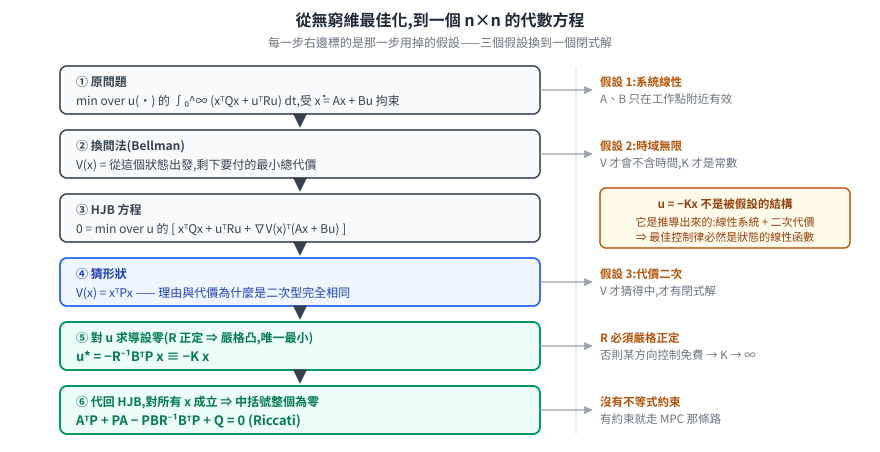</p>

整條推導鏈值得回頭看一次它做了什麼:**一個對無限維函數空間的最佳化問題,被壓成了一個 n×n 的代數方程**。壓縮的代價是三個假設——系統線性、代價二次、時域無限。三個都成立時,答案是閉式的;任何一個不成立,就得走 §12 的路。

### 5.4 離散版本:實機上跑的是這一條

MCU 或工控機每 `T` 秒算一次,系統要先離散化成 `x_{k+1} = A_d x_k + B_d u_k`(用矩陣指數 `A_d = e^{AT}`,或取樣週期夠短時用 `A_d ≈ I + AT`、`B_d ≈ BT`)。

同樣的動態規劃論證,把積分換成求和、把微分換成一步遞推:

$$ V(x_k) = \min_{u_k} \left[ x_k^{\mathsf T} Q x_k + u_k^{\mathsf T} R u_k + (A_d x_k + B_d u_k)^{\mathsf T} P (A_d x_k + B_d u_k) \right] $$

對 `u_k` 求導設零:`2Ru_k + 2B_dᵀP(A_d x_k + B_d u_k) = 0`,整理得

$$ \boxed{\; K = \left( R + B_d^{\mathsf T} P B_d \right)^{-1} B_d^{\mathsf T} P A_d \;} $$

$$ \boxed{\; P = A_d^{\mathsf T} P A_d - A_d^{\mathsf T} P B_d \left( R + B_d^{\mathsf T} P B_d \right)^{-1} B_d^{\mathsf T} P A_d + Q \;} $$

**離散代數 Riccati 方程(DARE)**。注意 `K` 的分母從連續版的 `R` 變成 `R + B_dᵀPB_d`——多出來那項是「這一步的輸入會影響下一步的代價」,連續版因為步長趨近零而消失。

實務上兩件事:離散版才是實機跑的東西,取樣週期比系統時間常數慢時,用連續 `K` 直接丟進離散迴路會不穩;而 `P` 是離線解一次、`K` 存成常數,線上每個週期只做一次 `u = −Kx` 的矩陣乘法——**LQR 的線上成本是 4 次乘加,比 PID 貴不了多少**。貴的是離線那一次求解。

---

## 6. LQR 保證什麼:可控性、穩定性,與裕度

`u = −Kx` 解出來了,但憑什麼相信閉迴路會穩?這一節把保證與**保證的邊界**都講清楚。

### 6.1 前提:可控性

Riccati 方程有解、`P` 正定,需要系統本身滿足條件。最基本的是**可控(controllable)**:能不能用有限的輸入把狀態從任意起點推到任意終點。

判準是可控性矩陣滿秩:

$$ \mathcal{C} = \begin{bmatrix} B & AB & A^2 B & \cdots & A^{n-1} B \end{bmatrix}, \qquad \operatorname{rank}(\mathcal{C}) = n $$

**為什麼只算到 `A^{n-1}B` 就夠?** 由 Cayley–Hamilton 定理,`Aⁿ` 可以寫成 `I, A, …, A^{n-1}` 的線性組合,所以 `AⁿB` 落在前面那些行張成的空間裡,再往後加不會增加秩。`n` 步就到頂。

它的物理意義:`B` 是「一步能推的方向」,`AB` 是「推完之後系統自己把它帶到哪」,以此類推。這些方向張不滿整個空間,就表示**有些狀態方向你根本推不動**——那個方向如果又剛好不穩定,再好的控制器也救不回來。

嚴格說 LQR 只需要**可穩(stabilizable)**:不可控的方向本身是穩定的就行(它會自己衰減)。另一邊還需要 `(A, Q^{1/2})` **可檢測(detectable)**:代價函數要「看得到」所有不穩定的方向,否則控制器會允許一個不被懲罰的方向偷偷發散。

(`Q^{1/2}` 是 `Q` 的**矩陣平方根**,滿足 `(Q^{1/2})ᵀQ^{1/2} = Q`。用它是因為代價可以寫成 `xᵀQx = ‖Q^{1/2}x‖²`——於是「代價看不看得到某個狀態方向」這個問題,剛好等價於「把 `Q^{1/2}` 當成輸出矩陣時,那個方向可不可觀測」,可檢測性正是為這種問法定義的。)

### 6.2 穩定性:value function 就是 Lyapunov 函數

滿足上述條件時,LQR 的閉迴路 `ẋ = (A − BK)x` **保證漸近穩定**。證明短得漂亮,而且和 [動力學那篇 §9](robot-dynamics.md#9-動力學拿來控制computed-torque-與-pd--重力補償) 的 PD + 重力補償是同一套工具。

取 `V(x) = xᵀPx`(就是 value function,`P > 0` 所以 `V > 0`),沿閉迴路軌跡微分:

$$ \dot{V} = \dot{x}^{\mathsf T} P x + x^{\mathsf T} P \dot{x} = x^{\mathsf T}\left[ (A - BK)^{\mathsf T} P + P(A - BK) \right] x $$

把中括號展開成四項:

$$ (A - BK)^{\mathsf T} P + P(A - BK) = \underbrace{A^{\mathsf T} P + PA}_{①} - \underbrace{K^{\mathsf T} B^{\mathsf T} P}_{②} - \underbrace{PBK}_{③} $$

手上有兩樣工具:`K = R⁻¹BᵀP`,也就是 **`BᵀP = RK`** 與(取轉置)**`PB = KᵀR`**;以及 Riccati 方程移項後的 `AᵀP + PA = PBR⁻¹BᵀP − Q`。逐項換掉:

- **①** `AᵀP + PA = PBR⁻¹BᵀP − Q`,而 `PBR⁻¹BᵀP = (KᵀR)R⁻¹(RK) = KᵀRK`,所以 ① `= KᵀRK − Q`
- **②** `KᵀBᵀP = Kᵀ(RK) = KᵀRK`
- **③** `PBK = (KᵀR)K = KᵀRK`

合起來:`(KᵀRK − Q) − KᵀRK − KᵀRK = −Q − KᵀRK`。代回去:

$$ \dot{V} = -x^{\mathsf T}\left( Q + K^{\mathsf T} R K \right) x \;=\; -\left( x^{\mathsf T} Q x + u^{\mathsf T} R u \right) \;\le\; 0 $$

(最後一個等號:`u = −Kx`,所以 `uᵀRu = xᵀKᵀRKx`。)

這個結果的意思值得停下來看:**`V` 的下降速率,剛好等於此刻正在付的代價**。而 `V(x)` 本身是「從這裡出發剩下要付的總代價」。整件事自洽得像會計帳——剩餘代價每一秒減少的量,正好是這一秒花掉的量。付光了(`V → 0`),就是到達目標了。

### 6.3 裕度:LQR 的招牌,以及它的邊界

LQR 還有一組經典的**穩定裕度**保證:單輸入情況下,閉迴路容許

- **增益裕度**:實際增益在名目值的 `1/2` 到 `∞` 倍之間都保持穩定;
- **相位裕度**:至少 `60°`。訊號繞迴路一圈回來時會有時間延遲,延遲換算成角度就是相位落後;落後累積到 180° 時負回授會變成正回授而失穩,相位裕度就是「還剩多少度的餘地」。

這是很強的性質——馬達實際輸出比預期大一倍、或小到一半,系統照樣穩。它來自 LQR 的迴路傳遞函數滿足一個叫 **Kalman 不等式**的頻域條件:訊號繞迴路一圈的「回歸差」絕對值在**所有頻率上都不小於 1**。這是 Kalman 1964 解「反最佳控制問題」時得到的結果——他問的是「給定一個控制律,有哪些代價函數會讓它成為最佳解」,而答案正是這條頻域條件。

**但這組保證有明確的失效條件,叉車上每一條都會踩到:**

| 失效條件 | 叉車上的具體樣子 |
|---|---|
| 只對線性模型成立 | 真車有 `sin/cos`、輪胎側偏非線性;線性化只在工作點附近有效 |
| 假設**全狀態可量測** | `ė_y`、`ė_θ` 量不到,要靠估測器(EKF)推算 |
| 一旦串上估測器就**失效** | 這是 LQG,見下 |
| 假設**輸入無飽和** | 轉向角有機械上限、加速度有牽引力上限,飽和後所有保證作廢 |

其中第三條特別要記住:把 LQR 的 `K` 和一個 Kalman 濾波器串起來(這個組合叫 **LQG**),那組漂亮的裕度保證**完全消失**——可以構造出增益裕度趨近於零的例子。這是控制理論裡有名的負面結果,也是後來 H∞ 與強健控制發展的起點。

實務上的處置很直接:**把 LQR 的裕度保證當成「線性、無約束、全量測」這個理想世界裡的性質,不要拿它當實車的安全論證**。實車的安全論證來自別的地方——限速、保護性停止、安全掃描器,那是 [ISO 3691-4 那條線](../60-compliance/README.md) 的事,不是控制器的事。

---

# Part B — 叉車與搬運車

## 7. 先把車寫成方程:叉車不是差速車

送餐機器人是兩輪差速,`(v, ω)` 直接由左右輪速差給出,可以原地旋轉。**叉車不是。** [叉車模擬那篇 §3.1](../50-physical-ai/project-forklift-rmf-gazebo.md#31-先搞清楚真實叉車的驅動轉向不是差速) 已經盤過主流構型,這裡只取控制上真正重要的那一件事:

| 構型 | 驅動 | 轉向 | 控制輸入 |
|---|---|---|---|
| 兩輪差速(送餐機器人) | 左右輪各一馬達 | 靠輪速差 | `(v_L, v_R)` 或等價的 `(v, ω)` |
| 三輪平衡重式叉車 | **前兩輪**(靠近貨叉、承載側) | **後單輪**主動轉向 | `(v, δ)` |
| 前移式 / 電動拖板車 | **後方單一舵輪**(驅動與轉向同一輪) | 同一顆輪 | `(v, δ)` |

兩種叉車構型的控制輸入都是 **`(v, δ)`——速度與轉向角**,不是 `(v, ω)`。這個差別不是換個符號而已:

**差速車的 `ω` 可以在 `v = 0` 時非零**(原地旋轉);**叉車的 `ω` 與 `v` 相乘綁死**,`v = 0` 時不管方向盤打多死,車都不轉。這是叉車路徑規劃必須用 Hybrid-A* / Reeds-Shepp 而不能用格點 A* 的根本原因([路徑規劃那篇](../10-core/30-navigation/path-planning.md) §3 有對照)。

### 7.1 舵輪車的運動學:ω = v·tanδ / L 從哪來

推導只用一個約束:**輪子不側滑**——每顆輪的速度必須沿著自己的滾動方向。因此每顆輪的**垂線**都通過同一點,那個點就是**瞬時旋轉中心(ICR)**。這和 [差速車的 ICC 推導](../20-forms/wheeled-amr/chassis-and-drivetrain.md#11-兩輪差速-differential-drive) 是同一個工具,只是輪子的排法不同。

<p align="center">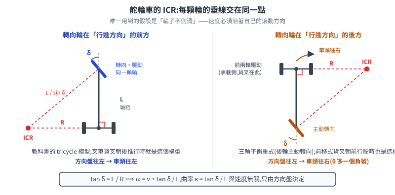</p>

以「轉向輪在前、固定軸在後」的標準三輪車為例,軸距 `L`,轉向角 `δ`:固定後軸的垂線就是後軸的延長線,轉向輪的垂線與它交於 ICR。轉彎半徑 `R`(從 ICR 到後軸中心)由直角三角形給出:

$$ \tan\delta = \frac{L}{R} \quad\Longrightarrow\quad R = \frac{L}{\tan\delta} $$

後軸中心以速度 `v` 繞 ICR 轉,角速度就是 `ω = v/R`:

$$ \boxed{\;\dot\theta = \omega = \frac{v \tan\delta}{L}\;}, \qquad \dot{x} = v\cos\theta, \qquad \dot{y} = v\sin\theta $$

(這裡的 `v` 指**後軸中心**的速度;§10 換成轉向輪在後的構型時,`v` 會改指前軸中心,兩節各自標明。)

路徑曲率 `κ = ω/v = tanδ/L`,**與速度無關,只由方向盤決定**——這是幾何約束,不是動力學。它同時給出最小轉彎半徑:`δ` 有機械上限 `δ_max`,所以 `R_min = L/tan δ_max`。叉車在窄巷道能不能轉得過去,這條式子就講完了。

上面用的是教科書式的「轉向輪在前」排法。三輪平衡重式叉車是**反過來**的——轉向輪在後、驅動在前軸,那個構型會多長出一個性質,留到 §10 專門處理。

### 7.2 這是一個非完整約束

「輪子不側滑」寫成方程是:

$$ \dot{x}\sin\theta - \dot{y}\cos\theta = 0 $$

它限制的是**速度**,不是位置。[動力學那篇 §8](robot-dynamics.md#8-帶約束的動力學輪子接觸閉鏈) 講過這種約束積不回去,所以叫**非完整(nonholonomic)**。實務上的意思:叉車能到達平面上任何一個位姿(側向平移不是不可能,只是要靠一連串進退轉向湊出來)——但**不能沿著任意路徑**過去。這正是倉庫裡「叉車在棧板前來回喬三次」的數學來源。

---

## 8. 四層迴路:哪一層用 PID,哪一層用 LQR

一台自動叉車跑起來時,同時有四個回授迴路在不同頻率上工作:

<p align="center">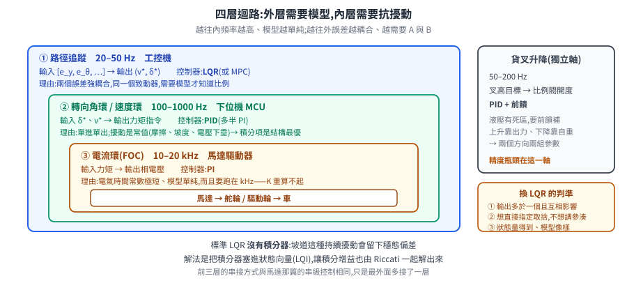</p>

| 層 | 頻率 | 控制什麼 | 典型控制器 | 為什麼是它 |
|---|---|---|---|---|
| 路徑追蹤 | 20–50 Hz | 橫向 + 航向誤差 → `(v, δ)` 目標 | **LQR** 或 MPC | 多個誤差互相耦合,需要模型 |
| 轉向角環 | 100–500 Hz | 舵輪實際角度 → 轉向馬達 | **PID**(常 PI) | 單進單出,擾動主要是常值(摩擦) |
| 速度環 | 100–1000 Hz | 車速 → 驅動力矩 | **PID**(常 PI) | 同上,加上坡度這種常值擾動 |
| 電流環(FOC) | 10–20 kHz | 力矩 → 相電流 | **PI** | 電氣時間常數極短,模型單純 |
| 貨叉位置環 | 50–200 Hz | 叉高 → 液壓比例閥開度 | **PID + 前饋** | 單軸,但有重力偏置與死區 |

前三層的串接方式與 [馬達那篇的串級控制](../10-core/10-hardware/motors-and-foc.md) 是同一個模式,只是最外面多接了一層。

### 8.1 判準:什麼時候該從 PID 換成 LQR

不是「越外層越高級」。判準有三條,**符合任何一條就值得考慮 LQR**:

1. **輸出多於一個,而且互相影響。** 轉向會改變航向也改變橫向位置;油門會改變速度也改變離心力。兩個獨立 PID 各修各的,會互相把對方的努力抵銷掉。
2. **想直接指定取捨,而不是調參湊。** PID 的三個增益與「我要多平穩、方向盤可以動多兇」之間沒有直接對應;LQR 的 `Q/R` 就是那個取捨本身。
3. **狀態量測得到(或估測得出來),而且有像樣的模型。** LQR 的全部本錢就是 `A`、`B`。沒有模型,它退化成一組沒有理由的增益。

反過來,**PID 在內層是對的選擇,而且很難被取代**:

- 內層的擾動主要是**常值**(靜摩擦、坡度、電池電壓下垂),而積分項對常值擾動是**結構上的最優解**(§2.2 的內模原理)。LQR 的標準形式**沒有積分器**——它把狀態壓到零,但若存在持續的常值擾動,穩態會留下偏差。
- 內層的模型會漂(馬達溫度、機械磨損),PID 不需要模型正確。
- 內層要跑在 kHz 等級,`u = −Kx` 雖然便宜,但重算 `K` 不便宜。

### 8.2 LQR 沒有積分器,這件事會咬人

上面那點值得展開,因為它是實務上最常見的踩雷。

叉車在 3% 坡道上用 LQR 做路徑追蹤,坡度造成一個持續的橫向拉力(車會往下坡側漂)。LQR 會盡力壓,但因為代價函數同時懲罰控制力,**最佳解是「留一點誤差、少出一點力」**——穩態橫向偏差不會歸零。

標準解法是**把積分器塞進狀態向量**(稱作 LQI 或 servo LQR):新增一個狀態 `x_I`,定義 `ẋ_I = e_y`,擴增系統

$$ \begin{bmatrix} \dot{x} \\ \dot{x}_I \end{bmatrix} = \begin{bmatrix} A & 0 \\ C & 0 \end{bmatrix} \begin{bmatrix} x \\ x_I \end{bmatrix} + \begin{bmatrix} B \\ 0 \end{bmatrix} u $$

對擴增後的系統解 LQR,得到的 `K` 自動含一項作用在 `x_I` 上——**那就是積分增益,而且它的大小是最佳化算出來的,不是調出來的**。代價是:多一個狀態要防 windup,飽和時同樣要停止累積。

---

## 9. 路徑追蹤:狀態向量怎麼定,以及為什麼不能拆成四個 PID

### 9.1 誤差的定義

<p align="center">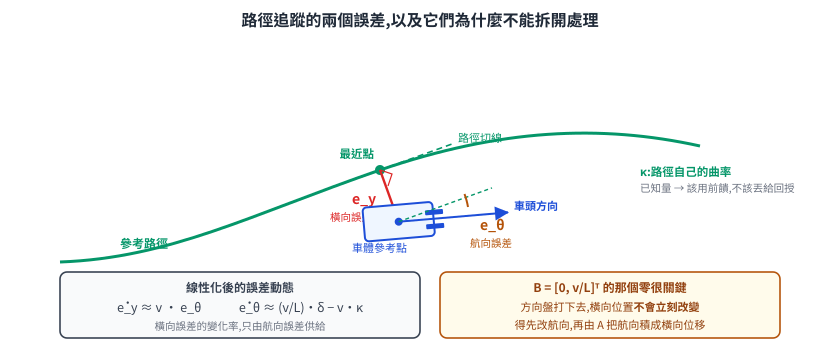</p>

在參考路徑上找到離車最近的點,定義兩個誤差:

- **橫向誤差 `e_y`**:車體參考點到路徑的垂直距離(有號,左負右正)。
- **航向誤差 `e_θ = θ − θ_path`**:車頭方向與路徑切線的夾角。

小誤差、定速 `v` 之下線性化,得到誤差動態:

$$ \dot{e}_y = v \sin e_\theta \approx v\, e_\theta, \qquad \dot{e}_\theta = \omega - v\kappa = \frac{v\tan\delta}{L} - v\kappa \approx \frac{v}{L}\delta - v\kappa $$

第二式的 `−vκ` 是**路徑本身在轉彎**:即使車完全貼著路走,航向也得跟著曲率一起轉。這一項不是誤差,是已知的參考量——所以它該用**前饋**處理,不該丟給回授去追(§9.3)。

### 9.2 為什麼四個獨立 PID 會打架

寫成狀態空間就一目了然。取 `x = [e_y, e_θ]ᵀ`、`u = δ`:

$$ \dot{x} = \underbrace{\begin{bmatrix} 0 & v \\ 0 & 0 \end{bmatrix}}_{A} x + \underbrace{\begin{bmatrix} 0 \\ v/L \end{bmatrix}}_{B} \delta $$

看 `B`:**轉向角只能直接影響 `e_θ`,對 `e_y` 的那一格是零**。方向盤打下去,橫向位置不會立刻改變,得先改變航向,再由 `A` 矩陣右上角那個 `v` 把航向誤差「積」成橫向位移。

<p align="center">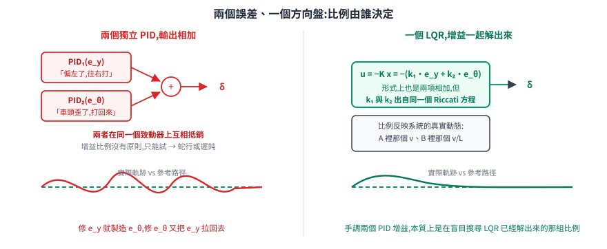</p>

於是「用一個 PID 修 `e_y`、另一個 PID 修 `e_θ`,兩個輸出相加」這種做法的病就清楚了:

- 修 `e_y` 的 PID 想打方向盤 → 立刻製造 `e_θ` → 修 `e_θ` 的 PID 立刻反向打回去。兩者在**同一個致動器**上互相抵銷。
- 兩個增益的比例沒有原則可循,只能試。比例錯了就蛇行(oscillation)或反應遲鈍。

LQR 解的正是這個:`u = −K x = −(k_1 e_y + k_2 e_\theta)`,形式上看起來也是「兩項相加」——**差別在 `k_1` 與 `k_2` 是從同一個 Riccati 方程一起解出來的**,它們的比例反映了系統的真實動態(`A` 裡那個 `v`、`B` 裡那個 `v/L`)。手調兩個 PID 增益,本質上是在盲目搜尋 LQR 已經解出來的那組比例。

### 9.3 完整的實作形式:前饋 + LQR

實務上狀態向量會更大。**PythonRobotics** 的 LQR 速度轉向控制器用五維:

$$ x = \begin{bmatrix} e_y & \dot{e}_y & e_\theta & \dot{e}_\theta & e_v \end{bmatrix}^{\mathsf T}, \qquad u = \begin{bmatrix} \delta & a \end{bmatrix}^{\mathsf T} $$

帶上變化率是因為誤差動態本身是二階的(有慣性與側偏);帶上速度誤差 `e_v` 是為了讓縱向與橫向共用一個代價函數(彎道要不要減速,交給 `Q/R` 決定,而不是另外寫規則)。

**Baidu Apollo** 的橫向控制器用四維(去掉速度誤差,縱向另外一個控制器管),疊加一個由路徑曲率算出的**開迴路前饋轉向角**:

$$ \delta = \underbrace{\arctan(L\kappa)}_{\text{前饋:路徑要求的轉向}} \; \underbrace{-\; Kx}_{\text{回授:修掉偏差}} $$

前饋項就是 §7.1 那條式子的反解(`κ = tanδ/L`)。這一項處理「路徑本身在彎」,回授只負責處理擾動與模型誤差——回到 §1 最後那句:**前饋處理已知,回授處理未知**。少了前饋,LQR 在彎道會持續留一個穩態偏差(因為 `−vκ` 對它而言是持續擾動,而它沒有積分器)。

> Apollo 橫向控制器的狀態向量定義來自 GitHub issue 討論與第三方分析,**本篇未直接讀到現行原始碼**(嘗試取用的檔案路徑已回 404,repo 結構有變動)。PythonRobotics 的五維定義則直接對得上其官方文件。

---

## 10. 後輪轉向的代價:叉車為什麼載重時倒著開

這一節推一個結論,它同時解釋了叉車的操控特性與「為什麼倒車行駛反而好控制」。

三輪平衡重式叉車是**後輪轉向、前軸驅動**。這個構型在控制上有一個具體的性質,推一次就看得到。

### 10.1 推導:轉向輪在後,ICR 也在後

沿用 §7.1 的無側滑約束,但這次轉向輪在**後**、固定軸在**前**。設前軸中心 `F` 以速度 `v` 沿車體軸前進,後輪轉角 `δ`,軸距 `L`。

前輪不轉向 ⟹ `F` 的速度沿車體縱軸。後軸中心 `R = F − L(\cos\theta, \sin\theta)`,對時間微分並投影到車體座標:

$$ \dot{R}_{\text{縱向}} = v, \qquad \dot{R}_{\text{橫向}} = -L\dot\theta $$

後輪的速度方向與車體軸夾 `δ` 角:

$$ \tan\delta = \frac{-L\dot\theta}{v} \quad\Longrightarrow\quad \boxed{\;\dot\theta = -\frac{v\tan\delta}{L}\;} $$

**多了一個負號。** 後輪往左打,車體順時針轉(車頭往右)——這與前輪轉向相反,是叉車駕駛要重新學習的第一件事。

### 10.2 車尾會先往錯的方向走:右半平面零點

現在看**後軸中心的橫向位置** `y_R` 對轉向輸入 `δ` 的響應。直線行駛附近線性化(`θ` 小、`v` 定值):

$$ \dot{y}_F = v\theta, \qquad \dot\theta = -\frac{v}{L}\delta, \qquad y_R = y_F - L\theta $$

$$ \dot{y}_R = \dot{y}_F - L\dot\theta = v\theta + v\delta $$

到這裡都還是時域的微分方程。要看出「先往錯方向走」這件事,得換到**拉氏轉換(Laplace transform)**的語言——它的作用只有一個:**把微分方程換成代數方程**,而規則簡單到可以當黑箱用:

| 時域 | 拉氏域 |
|---|---|
| 函數 `f(t)` | `F(s)` |
| **微分一次** `ḟ` | **乘上 `s`** |
| **積分一次** `∫f` | **除以 `s`** |

於是 `θ̇ = −(v/L)δ` 兩邊轉換就成了 `sΘ(s) = −(v/L)Δ(s)`,移項得 `Θ(s) = −v/(Ls)·Δ(s)`——原本要解微分方程,現在只是移項。

把輸出與輸入的比值寫出來叫**轉移函數**,它把「這個系統對輸入怎麼反應」壓成一個分式。關鍵在於:**分母的根叫極點,決定反應衰不衰減;分子的根叫零點,決定反應的形狀**。接下來要看的就是零點跑到哪裡去了。代入:

$$ \frac{Y_R(s)}{\Delta(s)} = \frac{1}{s}\left( v\cdot\left(-\frac{v}{Ls}\right) + v \right) = \frac{v\,(Ls - v)}{L\,s^{2}} $$

<p align="center">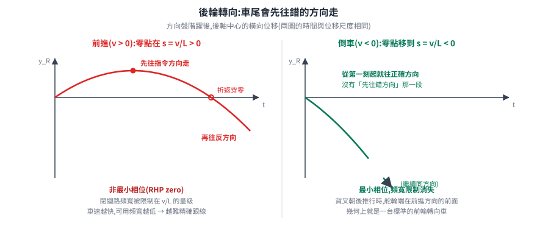</p>

分子的零點在 **`s = v/L`**。前進時 `v > 0`,零點落在**右半平面**——這是**非最小相位(non-minimum phase)**系統的定義性特徵,行為上就是:**階躍輸入後,輸出先往錯的方向走一段,才折回正確方向**。

物理上完全對得上:後輪往左打,車尾**立刻**被推向左邊(那是 `+vδ` 那一項,直接效應);但車體開始順時針轉,長期而言後軸中心會往右走。**先左後右**。

這件事在控制上的代價是硬的:**右半平面零點限制了閉迴路能達到的頻寬**——頻寬就是「這個迴路跟得上多快的變化」,頻寬越高、對擾動反應越快。增益拉高到某個程度以上,系統必定不穩;這不是調參技巧的問題,是系統本身的性質,任何控制器都繞不過去。經驗法則是閉迴路頻寬大致要壓在 RHP 零點頻率的一半以下(`ω_c ≲ v/2L`,是啟發式不是定理):**車速越快,可用頻寬越低**。叉車越開越快就越難精確跟線,原因在此。

同時注意:以**前軸中心**為參考點時,`Y_F(s)/Δ(s) = -v^2/(Ls^2)` 是純雙積分,**沒有零點**。所以控制參考點選在哪裡,決定了問題好不好解——貨叉在前軸,對位時把參考點取在貨叉上,反而是最容易控的選擇。

### 10.3 倒車:零點跑到左半平面

倒車時 `v < 0`(叉車載重時常這樣開),零點 `s = v/L` 變成**負的**——落在左半平面,系統變成**最小相位**,那個頻寬限制消失了。

換個角度看更直觀:貨叉朝後推行時,舵輪端在**前進方向的前面**,整台車在幾何上就是一台標準的**前輪轉向**車。而前輪轉向對前軸參考點是最小相位的,沒有那個「先往錯方向走」的行為。

> **誠實標記**:叉車載重時倒車行駛,文獻與原廠訓練資料明講的理由是**視野**(貨物擋住前方)與**載重分配**。上面這個「倒車在控制上反而是最小相位」的結論,是本篇從運動學推出來的,**沒有查到把它當作叉車設計或操作規範理由的文獻**。推導本身可以逐步驗算,但不要把它當成業界的既有論述引用。

至於**自動控制器**在倒車時的處理,文獻上是明確的:純幾何跟線控制器(pure pursuit)**不能直接沿用前進的版本**。倒車路徑追蹤的研究(以聯結車輛為主)做法是改變前視點的參考位置並加上額外的穩定控制器。用 LQR 的話處理方式單純得多——`v` 是模型的參數,倒車就是 `v < 0`,`A`、`B` 跟著變號,重解一次 Riccati 得到另一組 `K`。**模型型控制器的一個實質好處**:方向反轉不需要新的設計,只需要新的參數。

---

## 11. 載重從 2 噸變 3.5 噸:增益要不要換

### 11.1 變的是什麼

叉車空車與滿載之間,變的不只是重量:

| 量 | 空車 → 滿載 | 對控制的影響 |
|---|---|---|
| 總質量 `m` | 例如 2 t → 3.5 t | 同樣力矩,加速度剩下 57% |
| 繞垂直軸的轉動慣量 `I_z` | 貨物離質心越遠,增加越多 | 轉向響應變鈍 |
| 質心位置 | 往貨叉端(前方)移 | 前軸負載增加、後舵輪負載減少 |
| 舵輪法向力 | **變小** | 舵輪的可用側向力變小,更容易打滑 |
| 質心高度 | 貨叉舉高時大幅上升 | 側翻風險,轉彎速度上限要下修 |

最後兩列是叉車特有、而且是安全等級的。三輪平衡重式叉車只有**三個**接地點,合成重心必須留在它們圍成的**支撐三角形**內:

<p align="center">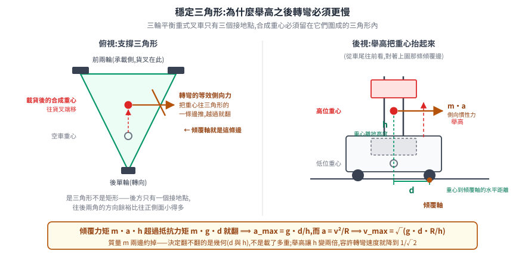</p>

翻不翻只是兩個力矩的比較。轉彎時的等效側向力 `m·a` 作用在重心上,對傾覆邊(前輪接地點)產生**傾覆力矩 `m·a·h`**;重力對同一條邊產生**抵抗力矩 `m·g·d`**。翻覆的條件是前者超過後者:

$$ m\,a\,h > m\,g\,d \quad\Longrightarrow\quad a_{\max} = g\,\frac{d}{h} $$

**質量 `m` 兩邊約掉了**——決定翻不翻的是幾何(重心多高、離邊多遠),不是載了多重。再把向心加速度 `a = v²/R` 代進去,就得到轉彎速度的上限:

$$ v_{\max} = \sqrt{\frac{g\,d\,R}{h}} $$

舉高讓 `h` 變成兩倍,容許的轉彎速度就降到 `1/√2`。這條式子劃出的是**控制器不該進入的區域**,而不是控制器該去穩住的區域——它屬於機構與安全規範的範疇,對應的處置是限速與限轉彎半徑([法規那條線](../60-compliance/README.md) 的功能安全項目),不是把 `Q/R` 調得更兇。

### 11.2 固定增益的代價,與增益排程

一組固定的 `K` 是在某個工作點解出來的。工作點漂走之後:

- 為**滿載**調的增益,拿去開空車 → 相對而言增益過大 → 過衝、蛇行。
- 為**空車**調的增益,拿去開滿載 → 增益不足 → 跟線遲鈍、彎道切內線。

而 §3.2 已經埋下伏筆:`A`、`B` 本來就只在工作點附近有效。對叉車而言,`B = [0, v/L]ᵀ` 裡**直接寫著 `v`**——速度一變,模型就變。這不是近似誤差,是模型的顯式參數。

**增益排程(gain scheduling)** 的做法:選幾個排程變數(叉車上最自然的是 `v` 與載重 `m`),在網格上的每個工作點離線解一次 Riccati,把 `K` 存成查表;線上量測當前的 `v` 與 `m`(載重可由液壓壓力感測器或稱重推得),查表 + 內插(二維表就是**雙線性內插**:先沿一軸插兩次得到兩個中間值,再沿另一軸把它們插一次)。

<p align="center">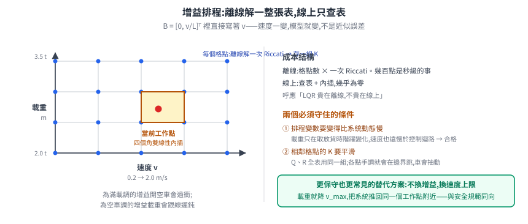</p>

線上成本幾乎為零(查表 + 內插),離線成本是「格點數 × 一次 Riccati 求解」——幾百個工作點在一般電腦上是秒級的事。這也回應 §5.4 那句:LQR 貴在離線,不貴在線上。

兩個條件必須守住:

1. **排程變數要變得比系統動態慢。** 載重只在取放貨時階躍變化,速度變化也遠慢於控制迴路——這兩個都合格。若排程變數變得跟系統一樣快,「凍結時間的線性化」這個前提就破了,穩定性沒有保證。
2. **相鄰工作點的 `K` 要平滑。** `Q`、`R` 在所有工作點保持同一組,`K` 通常就會隨工作點連續變化;若不同工作點各自手調 `Q/R`,查表在格點邊界會跳,車會抽動。

實務上還有一個更保守也更常見的替代方案:**不換增益,換速度上限**。載重時直接把 `v_max` 降下來,讓系統回到同一個工作點附近。這犧牲了效率,但不需要維護增益表,而且與安全規範想要的方向一致。

> **查證狀態**:「依載重切換控制增益」在叉車 / AGV 領域**沒有查到明確以 gain scheduling 命名的公開文獻或標準做法**。美國專利 US7568547(Drive control apparatus for forklift)提到監測載重變化來調整驅動控制,但本篇未細讀全文確認其機制是否為增益排程。上述內容是把通用的增益排程理論套到叉車的參數上,屬於推導而非產業實務的引用。

---

## 12. LQR 什麼時候不夠:約束,以及 MPC

### 12.1 LQR 的三個假設,叉車違反了三個

回到 §5 的推導。整條閉式解建立在三個假設上:

| 假設 | 叉車的現實 |
|---|---|
| 系統線性 | `sin/cos`、輪胎側偏、液壓死區;線性化只在工作點附近成立 |
| 代價二次、**無約束** | `\|δ\| ≤ δ_max`、加速度受牽引力限制、貨叉高度有上下限、走道有牆 |
| 時域無限 | 實際上要在「到達棧板前」這個有限距離內完成對位 |

其中**約束**是最要命的一條,因為 LQR 對它**完全無感**。`u = −Kx` 算出來的轉向角如果超過機械上限,只能硬夾在上限——而一旦夾住,§6 的所有穩定性保證立刻作廢(那些保證的前提是輸入就是 `−Kx`,不是被夾過的版本)。

更糟的是 LQR **不知道自己即將撞上約束**。它每一步只看當下狀態算一個最佳動作,沒有「往前看」的能力。叉車高速接近一個急彎,LQR 要等到偏差大到一定程度才會下大轉向指令——而那時可能已經超過 `δ_max` 能挽回的範圍。

### 12.2 MPC:把 LQR 的三個假設各鬆一條

<p align="center">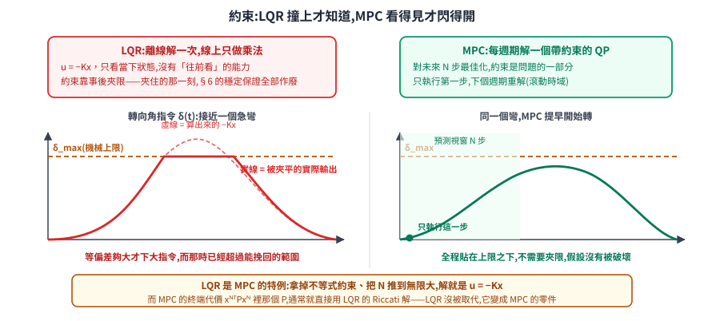</p>

**模型預測控制(MPC)** 做的事:在每個控制週期,對未來 `N` 步解一個**帶約束的最佳化問題**,只執行第一步,下個週期重解(滾動時域)。

$$ \min_{u_0 \dots u_{N-1}} \sum_{k=0}^{N-1} \left( x_k^{\mathsf T} Q x_k + u_k^{\mathsf T} R u_k \right) + x_N^{\mathsf T} P x_N \quad \text{s.t.}\quad \begin{cases} x_{k+1} = A x_k + B u_k \\ u_{\min} \le u_k \le u_{\max} \\ x_{\min} \le x_k \le x_{\max} \end{cases} $$

三件事值得指出:

1. **LQR 是 MPC 的特例。** 拿掉所有不等式約束、把 `N` 推到無限大,這個問題的解就是 `u = −Kx`。所以不是兩個競爭的方法,是同一個問題的兩種求解條件。
2. **終端代價 `x_Nᵀ P x_N` 裡的 `P`,通常就用 LQR 的 Riccati 解**(`N` 是預測視窗長度,自己選的參數——看多遠)。它代表「有限時域結束之後,剩下的無限尾巴要付多少」。但這只是穩定性保證的**一半**:在有約束的情況下,標準結果還要搭配一個**終端不變集**約束 `x_N ∈ Ω`——在那個集合裡,無約束的 LQR 律本身就可行且穩定,而 `Ω` 通常也是用同一個 `P` 定出來的。兩者合起來才構成保證。無論如何,**LQR 沒有被取代,它變成 MPC 的零件。**
3. **代價是線上算力。** 每個週期要解一個**二次規劃(QP,quadratic programming:代價是二次的、限制式是線性的最佳化問題,有成熟的求解器)**。叉車的路徑追蹤問題規模小(狀態 4–5 維、時域 10–20 步),現代 QP 求解器在工控機上跑 20–50 Hz 沒有問題;但這已經比 `u = −Kx` 的四次乘加貴了好幾個數量級,而且**求解時間不是定值**——即時系統要為最壞情況預留,或設迭代上限並備好退路。

### 12.3 中間選項

不是只有「LQR」與「MPC」兩格。實務上的階梯:

| 做法 | 處理了什麼 | 代價 |
|---|---|---|
| LQR + 輸出夾限 + anti-windup | 飽和時不至於失控 | 沒有保證,靠測試涵蓋 |
| LQR + 增益排程(§11) | 工作點漂移 | 要維護增益表 |
| **參考軌跡先滿足約束** | 讓規劃層產出的軌跡本來就不超過 `δ_max`、`a_max` | 需要規劃層與控制層共用同一組限制 |
| MPC | 顯式約束 + 預見 | 線上算力、求解時間不定 |

第三列常被忽略但投報率最高:如果 [路徑平滑那一層](../10-core/30-navigation/path-smoothing-and-trajectory.md) 產出的軌跡已經滿足曲率與加速度上限,控制器就很少需要飽和,LQR 的假設也就大致成立。**約束該在哪一層處理,是架構問題不是控制器問題**——這也是 Nav2 把規劃與控制分兩層的理由。

---

## 13. 取樣式 MPC:MPPI 怎麼繞過「代價必須是二次型」

§12 的 MPC 鬆開了 LQR 的約束假設,但它自己還留著一條:**要能解那個最佳化問題**。QP 求解器要求代價是凸的、限制式是線性的;非線性版(NLP)至少要求代價**可微**,因為求解器要算梯度。

問題是,移動機器人的代價根本不長那樣。

<p align="center">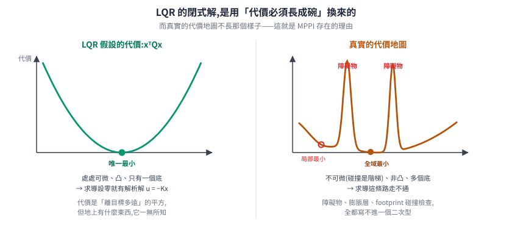</p>

「離目標多遠」確實可以寫成 `xᵀQx`,但「會不會撞到牆」不行。costmap 上的障礙物是查表查出來的階梯、footprint 碰撞檢查回傳的是布林值——**不可微,而且非凸**。

於是有了第三條路:**不要求解,改用取樣**。這就是 Nav2 預設路線上的 `nav2_mppi_controller`,MPPI(Model Predictive Path Integral,模型預測路徑積分)。

### 13.1 換一個問法:從最優控制序列,到最優控制分布

MPPI 的第一步不是換演算法,是**換問題**。

不要問「最優的控制序列 `u = (u_0, …, u_{T-1})` 是哪一條」,改問:「**軌跡的最優機率分布**長什麼樣?」

這個轉換看起來像把問題弄複雜了,但它換來一件事:**分布可以用取樣逼近,而序列不行**。

設定如下。控制序列上加高斯噪聲得到實際執行的指令:

$$ v_t = u_t + \varepsilon_t, \qquad \varepsilon_t \sim \mathcal{N}(0, \Sigma) $$

這定義了一個**基礎分布** `p`(以當前控制序列為均值的高斯)。把整條軌跡的代價寫成 `S(τ)`——注意它可以是任何東西,只要算得出一個數字。

現在要找一個新的分布 `q`,它要同時滿足兩個彼此拉扯的要求:**期望代價要低**,但**不能離 `p` 太遠**(離太遠就等於放棄了「從當前控制序列附近搜尋」這件事,而且取樣會失效)。寫成一個泛函:

$$ J[q] \;=\; \underbrace{\mathbb{E}_q\big[S(\tau)\big]}_{\text{代價要低}} \;+\; \lambda \underbrace{D_{\mathrm{KL}}\big(q \,\|\, p\big)}_{\text{不要離太遠}} $$

`λ > 0` 決定兩者的權衡,`D_KL` 是 KL 散度(衡量兩個分布差多少,恆非負,只有兩者相同時為零)。

### 13.2 這個問題有閉式解,而且答案必然是指數形式

`J[q]` 看起來要對「所有可能的機率分布」做最佳化——無窮維。但它有閉式解,而且推導只用到一件事:**KL 散度非負**。

先定義

$$ Z = \mathbb{E}_p\!\left[e^{-S(\tau)/\lambda}\right], \qquad q^*(\tau) = \frac{1}{Z}\, e^{-S(\tau)/\lambda}\, p(\tau) $$

`q*` 是個合法的機率分布(非負,而且除以 `Z` 之後積分為 1)。現在把 `J[q]` 硬湊成含 `q*` 的形式:

$$ J[q] = \mathbb{E}_q[S] + \lambda\,\mathbb{E}_q\!\left[\log\frac{q}{p}\right] = \lambda\,\mathbb{E}_q\!\left[\frac{S}{\lambda} + \log\frac{q}{p}\right] = \lambda\,\mathbb{E}_q\!\left[\log\frac{q}{p\,e^{-S/\lambda}}\right] $$

分母上下同乘 `Z`,把 `p e^{−S/λ}` 換成 `Z q*`:

$$ J[q] = \lambda\,\mathbb{E}_q\!\left[\log\frac{q}{Z\,q^*}\right] = \lambda\, D_{\mathrm{KL}}(q \,\|\, q^*) \;-\; \lambda \log Z $$

第二項與 `q` 無關。第一項是 KL 散度,**恆非負,而且只有在 `q = q*` 時為零**。所以:

$$ \boxed{\;q^*(\tau) = \frac{1}{Z}\, e^{-S(\tau)/\lambda}\, p(\tau)\;} \qquad\text{並且}\qquad \min_q J[q] = -\lambda \log \mathbb{E}_p\!\left[e^{-S/\lambda}\right] $$

**指數權重不是一個設計選擇,是推導的結果**——就像 §5 的 `u = −Kx` 一樣。要「代價低 + 不離基礎分布太遠」,答案必然是拿 `e^{−S/λ}` 去重新加權原本的分布:代價越低的軌跡,權重指數級地越高。

> 右邊那個下界 `−λ log E_p[e^{−S/λ}]` 在文獻裡叫**自由能**(free energy),這條不等式則是統計物理裡的 Gibbs 變分原理。不同文獻的自由能定義可能差一個 `−λ` 因子(熱力學慣例與資訊論慣例的差別),但最優分布 `q*` 的形式不受影響。

### 13.3 從理論分布到算得出來的權重:重要性取樣

`q*` 有了,但**不能直接從它取樣**——`Z` 是一個對所有軌跡的積分,算不出來。

解法是**重要性取樣**:從我們會取樣的 `p`(高斯,隨手就能撒)取樣,再用密度比修正。對任意函數 `f`:

$$ \mathbb{E}_{q^*}[f] = \mathbb{E}_p\!\left[\frac{q^*}{p}\,f\right] = \frac{1}{Z}\,\mathbb{E}_p\!\left[e^{-S/\lambda} f\right] $$

用 `K` 條取樣軌跡近似,分子分母的 `Z` **對消掉**:

$$ \mathbb{E}_{q^*}[f] \;\approx\; \sum_{k=1}^{K} w_k\, f(\tau_k), \qquad \boxed{\;w_k = \frac{e^{-S_k/\lambda}}{\sum_{j=1}^{K} e^{-S_j/\lambda}}\;} $$

**這就是 softmax**,以 `−S_k/λ` 為 logit。那個算不出來的積分 `Z` 被分母的求和取代了——這正是重要性取樣買到的東西。

實作上還有一步:所有 `S_k` 同時減去 `ρ = min_j S_j`。分子分母同乘 `e^{ρ/λ}`,**權重完全不變**,但指數不會溢位。Nav2 原始碼裡就是這一行:

```cpp
auto costs_normalized = costs_ - costs_.minCoeff();     // 減最小值:數值穩定
const float inv_temp = 1.0f / s.temperature;            // 1/λ
auto softmaxes = (-inv_temp * costs_normalized).exp().eval();
softmaxes /= softmaxes.sum();                           // 正規化成權重
```

### 13.4 更新律:兩種等價的寫法

把 `f` 取成控制序列本身,就得到新的控制序列:

$$ u_t^{\text{new}} = \sum_{k=1}^{K} w_k\, v_{k,t} $$

而 `v_{k,t} = u_t + \varepsilon_{k,t}`,又 `Σ_k w_k = 1`,所以

$$ u_t^{\text{new}} = u_t \underbrace{\sum_k w_k}_{=1} + \sum_k w_k\, \varepsilon_{k,t} \;=\; u_t + \sum_{k=1}^{K} w_k\, \varepsilon_{k,t} $$

**兩種寫法是同一件事。** 原始論文寫成右邊(名目控制 + 加權噪聲),Nav2 原始碼寫成左邊(直接對取樣到的控制做加權平均):

```cpp
control_sequence_.vx = state_.cvx.transpose().matrix() * softmax_mat;
control_sequence_.wz = state_.cwz.transpose().matrix() * softmax_mat;
```

一句話講完整個演算法:**撒一批控制序列 → 各自往前模擬算代價 → 用 softmax 加權平均 → 這就是新的控制序列**。沒有梯度、沒有求解器、沒有迭代收斂判斷。

<p align="center">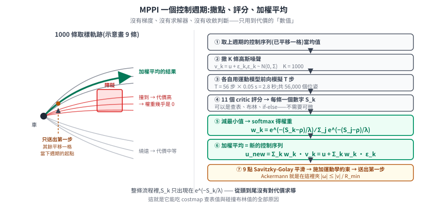</p>

還有兩個實作細節,少了會出事:

- **只送出第一步,然後把序列往前平移一格**。這是滾動時域的實作方式:下個週期不從零開始,而是拿這次剩下的 `T−1` 步當起點——所以「撒噪聲」是撒在**已經不錯的解**附近,而不是每次重新亂猜。這是 MPPI 能用區區一千條樣本就work的關鍵。
- **輸出後平滑**。Nav2 在加權平均之後、施加約束之前,套一個 9 點窗的 Savitzky-Golay 濾波器:

  ```cpp
  utils::savitskyGolayFilter(control_sequence_, control_history_, settings_);
  ```

  因為加權平均出來的序列在時間軸上可能有抖動,直接送給底盤會變成可感知的震動。

### 13.5 λ 是溫度:兩個極端都沒有用

`λ` 在 Nav2 裡的參數名就叫 `temperature`,而它的行為完全對得上這個名字:

| λ | 權重的樣子 | 行為 |
|---|---|---|
| **λ → 0** | 全部集中在代價最小的那一條 | 退化成 `argmin`——只信一條取樣軌跡,對取樣噪聲極度敏感,結果會抖 |
| **λ 適中** | 少數幾條好軌跡分掉大部分權重 | 平均掉取樣噪聲,同時仍偏好低代價區 |
| **λ → ∞** | 全部趨近 `1/K` | 退化成「不管代價的平均」,等於沒在控制 |

Nav2 預設 `temperature = 0.3`。這個參數的直覺是:**你有多相信「最好的那一條取樣」真的是最好的**。取樣越少、模型越不準,就越該調高一點。

還有一個相關的參數 `gamma`(預設 0.015)。Nav2 在算 softmax 之前,會先在代價上加一項:

```cpp
const float gamma_vx = s.gamma / (s.sampling_std.vx * s.sampling_std.vx);
costs_ += (gamma_vx * (bounded_noises_vx.rowwise() * vx_T).rowwise().sum()).eval();
```

也就是 `S_k ← S_k + (γ/σ²)·Σ_t ε_{k,t} u_t`。它懲罰「偏離名目控制太遠」的取樣,對應論文裡的控制能量正則化項——注意分母的 `σ²` 就是取樣分布的 `Σ`,兩者是綁在一起的,單獨調 `gamma` 而不管 `vx_std` 會得到意外的結果。

### 13.6 關鍵:為什麼它不需要代價可微,也不需要凸

回頭看整條推導鏈,`S(τ)` 出現的地方只有一個:`e^{−S_k/λ}`,也就是**把代價的數值代進指數函數**。

**從頭到尾沒有對 `S` 求導。**

所以 `S` 可以是任何算得出數字的東西:costmap 的查表值、footprint 的碰撞檢查(布林)、if-else 規則、甚至一個神經網路。這正是 Nav2 的 survey 明講的那句話:

> "Since this method does not involve the non-linear optimization stage found in most MPC techniques, the cost functions are **uniquely not required to be differentiable or convex** — yielding greater latitude in designing system behavior."

對照 §4.1 的結論會看得更清楚:**LQR 的閉式解是用「代價必須是二次型」換來的**。二次型可微、凸、有唯一最小,所以求導設零就解得出來。MPPI 放棄了閉式解,換到的正是這個限制的解除。

三者其實是同一條光譜上的三個點,差別在**對代價函數要求多少結構**:

| | 對代價的要求 | 怎麼找解 | 代價 |
|---|---|---|---|
| **LQR** | 必須是二次型 | 閉式解 `u = −Kx` | 只能跟線,障礙物寫不進去 |
| **QP-MPC** | 凸(或至少可微) | 數值最佳化,梯度式 | 求解時間不定,非凸會卡局部最優 |
| **MPPI** | **只要算得出數字** | 取樣 + 加權平均 | 沒有最優性保證,算力隨 K×T 成長 |

這張表也解釋了一件事:**ROS 2 官方沒有任何 LQR 控制器**。LQR 曾經列在 Nav2 的待辦演算法清單上,後來被劃掉,理由只有一句 `MPPI supersedes`;維護者對它的定性是 "MPC-lite"([navigation2#1710](https://github.com/ros-navigation/navigation2/issues/1710))。在一個必須處理 costmap 的框架裡,「代價必須是二次型」這個前提本身就出局了。

### 13.7 Nav2 的實際數字

以下參數與程式碼片段核對自 `nav2_mppi_controller` 的原始碼(`optimizer.cpp` 的 `getParams()` 與 `updateControlSequence()`):

| 參數 | 預設值 | 意義 |
|---|---|---|
| `batch_size` (K) | **1000** | 每週期撒幾條軌跡 |
| `time_steps` (T) | **56** | 往前看幾步 |
| `model_dt` | **0.05 s** | 每步的時間 |
| → 預測時域 | **2.8 s** | `T × model_dt` |
| `temperature` (λ) | **0.3** | 溫度 |
| `gamma` | **0.015** | 控制正則化 |
| `vx_std` / `wz_std` | **0.2 / 0.4** | 取樣噪聲的標準差 |
| `iteration_count` | **1** | 每週期迭代幾次 |

算一下規模:每個控制週期要前向模擬 `1000 × 56 = 56,000` 個位姿,再對每個位姿跑一遍所有 critic。這就是 survey 的 Table II 裡 MPPI 只有 **125 Hz** 而 RPP 有 **>4000 Hz** 的來源——差了三十幾倍,而那正是「不需要模型、閉式幾何」與「撒五萬個點」的差距。

代價函數不是一整塊,而是 **11 個可插拔的 critic**(原始碼 `src/critics/` 目錄):`ConstraintCritic`、`CostCritic`、`GoalCritic`、`GoalAngleCritic`、`ObstaclesCritic`、`PathAlignCritic`、`PathAngleCritic`、`PathFollowCritic`、`PreferForwardCritic`、`TwirlingCritic`、`VelocityDeadbandCritic`。每個各自對一批軌跡評分再加總——這種「代價可以隨意插拔」的架構,本身就是 §13.6 那個性質的直接產物:**因為不需要可微,所以可以讓使用者自己加**。

運動學模型支援 `DiffDrive`、`Omni`、`Ackermann` 三種。Ackermann 的約束施加方式很直接:

$$ |\omega| \le \frac{|v|}{R_{\min}} $$

把角速度夾在這個範圍內,而這正是 [§7.1](#71-舵輪車的運動學ω--vtanδ--l-從哪來) 那條 `κ = ω/v = tanδ/L` 的另一種寫法——最小轉彎半徑決定了曲率上限。**叉車的運動學約束,在 MPPI 裡就是這一行夾限。**

### 13.8 誠實的限制

MPPI 不是免費的:

- **沒有最優性保證。** 取樣是近似,`K` 不夠大就找不到好軌跡。這與 LQR「在線性模型下保證漸近穩定」是完全不同等級的承諾。
- **單峰高斯提議分布,遇到多峰代價地形會卡住。** 而「拿上一輪的解暖啟動」這個讓它高效的技巧,同時也會**固化局部最小**——已經在某個峰附近,就很難跳到另一個峰。這是公開文獻討論中的已知弱點。
- **硬約束是事後懲罰**,不是事前排除。軌跡違反了才被扣分,而不是一開始就不會被產生出來。
- **對 `λ` 與取樣標準差敏感**,而這兩者又互相耦合(見 `gamma` 的分母)。
- Nav2 的實作是 **CPU-only**(原論文用 GPU),靠 Eigen 向量化達到可用頻率。

---

## 14. 實作:算出 K,然後在 MCU 上跑

### 14.1 離線算 K(Python)

`scipy` 直接解 Riccati 方程;`python-control` 提供包好的 `lqr` / `dlqr`。

```python
import numpy as np
from scipy.linalg import solve_continuous_are, solve_discrete_are

# 叉車橫向誤差模型(§9.2):x = [e_y, e_theta], u = delta
L = 1.6      # 軸距 (m)
v = 1.0      # 工作點速度 (m/s)
T = 0.02     # 控制週期 (s),50 Hz

A = np.array([[0.0, v],
              [0.0, 0.0]])
B = np.array([[0.0],
              [v / L]])

# Bryson 法則起手(§4.3):容許橫向誤差 0.05 m、轉向角 1.2 rad
Q = np.diag([1.0 / 0.05**2, 1.0 / 0.20**2])   # 航向誤差容許 0.2 rad
R = np.array([[1.0 / 1.2**2]])

# --- 連續時間 ---
P = solve_continuous_are(A, B, Q, R)
K = np.linalg.solve(R, B.T @ P)               # K = R^-1 B^T P
print("continuous K =", K)

# --- 離散時間(實機跑這個)---
# 這個 A 滿足 A² = 0,所以 e^{AT} = I + AT 是精確值,不是近似
# B 的離散化同理:∫₀^T e^{Aτ}dτ · B = (T·I + T²A/2)·B —— T²/2 那一項不能省
Ad = np.eye(2) + A * T
Bd = (T * np.eye(2) + T**2 / 2 * A) @ B
Pd = solve_discrete_are(Ad, Bd, Q, R)
Kd = np.linalg.solve(R + Bd.T @ Pd @ Bd, Bd.T @ Pd @ Ad)
print("discrete K   =", Kd)

# 驗證閉迴路穩定:特徵值實部須為負(離散版須在單位圓內)
print("closed-loop eig (cont) =", np.linalg.eigvals(A - B @ K))
print("closed-loop eig (disc) =", np.linalg.eigvals(Ad - Bd @ Kd))
```

離散化那兩行值得多看一眼,因為它示範了一個容易照抄出錯的地方。零階保持的精確離散化是 `A_d = e^{AT}`、`B_d = \int_0^T e^{A\tau}\mathrm{d}\tau \cdot B`。這個 `A` 剛好滿足 `A² = 0`,於是矩陣指數的級數在第二項就截斷,`I + AT` **是精確值而非近似**;但同樣的理由也表示 `B_d = (TI + T^2A/2)B`,**`T²/2` 那一項不能跟著省掉**——省了會讓 `K` 的第二個元素偏掉約 2%。一般的 `A` 兩者都得用 `scipy.linalg.expm` 與數值積分算。

**最後兩行不要省。** 解出 `K` 不等於系統會穩——`(A, B)` 若不可控、或 `Q` 沒涵蓋到不穩定方向,Riccati 可能給出一個看起來正常的 `P`,而閉迴路特徵值告訴你真相。這是最便宜的驗證,離線做一次就好。

用 `python-control` 的等價寫法:

```python
import control
K, S, E = control.lqr(A, B, Q, R)        # 連續;E 直接就是閉迴路極點
Kd, Sd, Ed = control.dlqr(Ad, Bd, Q, R)  # 離散
```

### 14.2 線上執行(C,跑在下位機或工控機)

`K` 是離線算好的常數,線上只剩矩陣乘法:

```c
/* 路徑追蹤 LQR:K 由離線工具算出後寫死或由參數檔載入 */
static const float K[2] = { -14.14f, -5.30f };   /* 對應 [e_y, e_theta],示意值 */

float lqr_steer(float e_y, float e_theta, float kappa, float wheelbase)
{
    /* 前饋:路徑曲率本身要求的轉向角(§9.3) */
    float delta_ff = atanf(wheelbase * kappa);

    /* 回授:u = -K x */
    float delta_fb = -(K[0] * e_y + K[1] * e_theta);

    float delta = delta_ff + delta_fb;

    /* 飽和:超過機械上限就夾住(§12.1 的代價在此顯現) */
    if (delta >  DELTA_MAX) delta =  DELTA_MAX;
    if (delta < -DELTA_MAX) delta = -DELTA_MAX;
    return delta;
}
```

內層的速度環仍然是 PID,含 §2.3 的反算式 anti-windup:

```c
typedef struct {
    float kp, ki, kd, kt;   /* kt = 1/T_t,反算增益 */
    float integ, prev_meas;
    float out_min, out_max;
} pid_t;

float pid_step(pid_t *c, float ref, float meas, float dt)
{
    float e = ref - meas;

    /* D 對量測微分,避免 derivative kick(§2.4) */
    float deriv = -(meas - c->prev_meas) / dt;
    c->prev_meas = meas;

    float u = c->kp * e + c->integ + c->kd * deriv;

    /* 飽和 */
    float u_sat = u;
    if (u_sat > c->out_max) u_sat = c->out_max;
    if (u_sat < c->out_min) u_sat = c->out_min;

    /* 反算 anti-windup:不飽和時 (u_sat - u) = 0,自動退化成一般 I 項 */
    c->integ += (c->ki * e + c->kt * (u_sat - u)) * dt;

    return u_sat;
}
```

兩段程式碼放在一起,就是 §8 那張圖的實際樣子:**外層 LQR 一次處理耦合的誤差,內層 PID 各自吃掉常值擾動。**

---

## 15. 貨叉那一軸:為什麼精度瓶頸在垂直方向

底盤跟線只是前半場。真正決定「這趟搬運成不成功」的是貨叉能不能插進叉孔。

歐規 EPAL 棧板(1200×800 mm)的叉孔淨高是 **100 mm**(長邊每個孔淨寬 555 mm,短邊淨寬 894 mm)。把叉齒本身的厚度扣掉之後,**垂直方向的可用餘裕只剩幾十毫米**,而且要分給上下兩側。

橫向就寬鬆得多:單邊有一兩百毫米的餘裕。所以對位的精度瓶頸不在底盤定位,在**貨叉的高度控制與車身的姿態角**:

- **高度**:由貨叉位置環負責(§8 的第五層)。液壓比例閥有**死區**(閥芯開度小於某值時完全不出油)與**重力偏置**(下降靠自重、上升要出力,兩個方向的動態完全不同)。單一組 PID 增益吃不下這種不對稱,實務上上升與下降分兩組參數,並用前饋補掉死區。
- **姿態角**:車身偏 `1°`,長 1.2 m 的叉齒尖端就橫向偏 `1.2 × sin1° ≈ 21 mm`;偏 `2°` 就是 42 mm。**角度誤差在叉齒尖端被槓桿放大**——這正是 §9 把 `e_θ` 放進狀態向量、而不是只管 `e_y` 的實務理由。

換句話說,§9 那個「兩個誤差不能拆開處理」的結論,在對位這一段有了具體的量:**橫向對準了但車身歪 2°,叉齒尖端一樣差 42 mm**。

> 叉齒厚度依 ISO 2328 / ISO 2331 的分級而異,本篇**未取得標準原文的官方數字**,所以上面只寫「扣掉厚度後剩幾十毫米」而不給精確餘裕值。EPAL 的 100 mm 叉孔淨高與 555 / 894 mm 淨寬取自 EPAL 官方規格頁。

---

## 16. 誠實的邊界

- **這篇的 LQR 全部建立在線性模型上。** 叉車是非線性的,`A`、`B` 只在工作點附近成立。所有「保證穩定」的說法,保證的是那個線性模型的閉迴路,不是真車。
- **§6.3 的裕度保證在實車上幾乎必然失效**:狀態要靠估測(變成 LQG,裕度歸零)、輸入會飽和、模型會漂。把它當成理解 LQR 為什麼好用的性質,不要當成安全論證。
- **控制器不是安全機制。** 限速、保護性停止、安全掃描器、急停迴路屬於 [法規那條線](../60-compliance/README.md) 的功能安全範疇,它們必須在控制器之外獨立成立——控制器當掉時,那些東西還要work。
- **§10.3 的「倒車在控制上是最小相位」是本篇的推導,不是文獻引用。** 推導可以驗算,但沒有查到把它當作叉車設計理由的來源。
- **§11 的增益排程套用的是通用理論**,沒有查到叉車領域明確以此命名的公開文獻。
- **Apollo 橫向控制器的狀態向量定義來自二手來源**,未直接核對現行原始碼。
- **§13 的 Gibbs 變分原理推導是本篇自己推的**(只用到 KL 散度非負),結論與 MPPI 文獻一致,但**沒有逐式核對原始論文的式號**。另外不同文獻的自由能定義可能差一個 `−λ` 因子(熱力學慣例 vs 資訊論慣例),正文已標明這不影響 `q*` 的形式。
- §13.7 的 Nav2 參數預設值與程式碼片段**是原始碼級核對的**(`nav2_mppi_controller/src/optimizer.cpp`),不是只看文件——文件與原始碼曾出現不一致(Savitzky-Golay 濾波器在文件裡不明顯,原始碼裡確實有呼叫)。
- §13.8 的 MPPI 限制取自公開文獻的討論,不是官方自己列的清單。
- 幾項數字仍待查證:各機型舵輪的轉向角範圍、ISO 2328 各級叉齒尺寸、ISO 3691-4 的具體速度與停止距離要求(標準原文付費,本篇未購買)、主要自動叉車廠牌的官方定位精度規格。

---

## 17. 來源

**控制理論**

- Kalman, R. E., "Contributions to the theory of optimal control," *Boletín de la Sociedad Matemática Mexicana*, vol. 5, no. 2, pp. 102–119, 1960. — LQR 與 Riccati 方程用於最佳控制的原始文獻。
- Kalman, R. E., "[When Is a Linear Control System Optimal?](https://asmedigitalcollection.asme.org/fluidsengineering/article/86/1/51/392203/When-Is-a-Linear-Control-System-Optimal)," *ASME Journal of Basic Engineering*, vol. 86, no. 1, pp. 51–60, 1964. DOI: 10.1115/1.3653115 — Kalman 不等式(回歸差在所有頻率上 ≥ 1)的原始文獻,§6.3 單輸入裕度保證的出處。
- Safonov, M. G., Athans, M., "Gain and phase margin for multiloop LQG regulators," *IEEE Transactions on Automatic Control*, vol. AC-22, pp. 173–179, 1977. — 多迴路(多輸入)情形的推廣。注意它處理的是**狀態回授**的 regulator;含估測器的 LQG 是下一條那個負面結果的對象,兩者不衝突。
- Doyle, J. C., "[Guaranteed Margins for LQG Regulators](https://murray.cds.caltech.edu/images/murray.cds/b/b4/Guaranteed_margins_for_LQG_regulators_-_doyle.pdf)," *IEEE Transactions on Automatic Control*, vol. AC-23, pp. 756–757, 1978. DOI: 10.1109/TAC.1978.1101812 — 全文極短,摘要是有名的一句 "There are none.";§6.3 LQG 沒有裕度保證的出處。

**取樣式 MPC(MPPI)**

- Williams, G., Drews, P., Goldfain, B., Rehg, J. M., Theodorou, E. A., "Aggressive driving with model predictive path integral control," *2016 IEEE ICRA*, pp. 1433–1440. DOI: 10.1109/ICRA.2016.7487277 — Nav2 的 survey 引用的 MPPI 出處(該版用 GPU)。
- Williams, G., Aldrich, A., Theodorou, E. A., "Model Predictive Path Integral Control: From Theory to Parallel Computation," *Journal of Guidance, Control, and Dynamics*, vol. 40, pp. 344–357, 2017. DOI: 10.2514/1.G001921 — `nav2_mppi_controller` 的 README 引用的理論依據。
- Williams, G. et al., "[Information Theoretic MPC for Model-Based Reinforcement Learning](https://arxiv.org/abs/1707.02342)" (arXiv:1707.02342) — 自由能與 KL 散度那條推導鏈的資訊論版本。
- [`nav2_mppi_controller` 設定文件](https://docs.nav2.org/configuration/packages/configuring-mppic.html) 與[原始碼](https://github.com/ros-navigation/navigation2/tree/main/nav2_mppi_controller) — §13.7 的參數與程式碼片段核對自後者。
- [navigation2#1710 "Working list of algorithms to include"](https://github.com/ros-navigation/navigation2/issues/1710) — LQR 被劃掉、註明 `MPPI supersedes` 的原始紀錄。

**實作與工具**

- [`scipy.linalg.solve_continuous_are`](https://docs.scipy.org/doc/scipy/reference/generated/scipy.linalg.solve_continuous_are.html) / [`solve_discrete_are`](https://docs.scipy.org/doc/scipy/reference/generated/scipy.linalg.solve_discrete_are.html) — CARE / DARE 求解。
- [`control.lqr`](https://python-control.readthedocs.io/en/0.10.2/generated/control.lqr.html) / [`control.dlqr`](https://python-control.readthedocs.io/en/0.10.2/generated/control.dlqr.html) — python-control 的包裝,回傳 `(K, S, E)`。
- [PythonRobotics — LQR speed and steering control](https://atsushisakai.github.io/PythonRobotics/modules/6_path_tracking/lqr_speed_and_steering_control/lqr_speed_and_steering_control.html) — §9.3 五維狀態向量定義的出處,含可執行實作。
- [ApolloAuto/apollo issue #2841](https://github.com/ApolloAuto/apollo/issues/2841) — Apollo 橫向 LQR 控制器模型與狀態向量的討論(二手來源)。

**車輛與機構**

- [Path tracking and stabilization for a reversing general 2-trailer configuration](https://arxiv.org/pdf/1602.06675) (arXiv:1602.06675) — §10.3 倒車路徑追蹤需要重新設計控制器的文獻依據(對象是聯結車輛,非叉車)。
- [MathWorks — Mobile Robot Kinematics Equations](https://www.mathworks.com/help/robotics/ug/mobile-robot-kinematics-equations.html) — 差速 / Ackermann / 三輪車三種運動學模型的對照。
- [EPAL Euro Pallet 官方規格](https://www.epal-pallets.org/eu-en/load-carriers/epal-euro-pallet) — §15 的叉孔尺寸。
- ISO 3691-4:2023, *Industrial trucks — Safety requirements and verification — Part 4: Driverless industrial trucks and their systems* — 本篇**未購買原文**,只引用公開摘要的定性描述。
