# 高斯分布:第一性原理,以及它如何長成那麼多演算法

機器人定位用卡爾曼濾波、影像處理用高斯模糊、3D 重建用 Gaussian Splatting……同一個「高斯」在完全不同的領域反覆出現。這篇從第一性原理把高斯講清楚:**它是什麼、它的式子為什麼長那樣、它有哪幾條「超能力」性質**,然後用這幾條性質,從頭重新理解 Gaussian blur、Kalman/EKF、GP、GMM、3DGS——你會發現它們其實是同一個東西在不同問題裡的化身。

> 前置:會基本的平均、變異數即可,其餘從零講。
> 延伸閱讀:[定位](../30-navigation/localization.md)(EKF/AMCL 的高斯假設)、[感測器資料與 3D Gaussian 重建](../50-physical-ai/sensor-data-and-3d-reconstruction.md)(3DGS)。

---

## 第一部:高斯分布是什麼

### 1.1 先講「分布」要解決什麼問題

機器人量任何東西都帶不確定性:輪子說走了 1.00m,實際可能 0.98~1.02m。我們需要一個數學物件,描述「**最可能是多少,以及有多不確定**」。這個物件就是**機率分布**——一條曲線,橫軸是可能的值,曲線高的地方代表「比較可能」。

高斯分布(Gaussian distribution,又名常態分布 normal distribution)就是那條最常用的鐘形曲線:

<p align="center">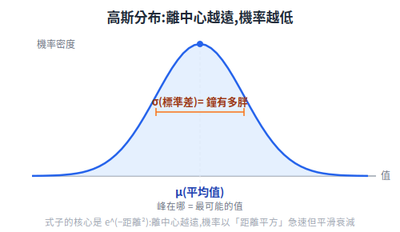</p>

### 1.2 它的式子為什麼長那樣(第一性原理)

一維高斯的機率密度函數:

$$ p(x) = \frac{1}{\sqrt{2\pi}\,\sigma} \, e^{-\frac{(x-\mu)^2}{2\sigma^2}} $$

先別急著背。把式子拆成幾個部位,各自在做一件很單純的事:

<p align="center">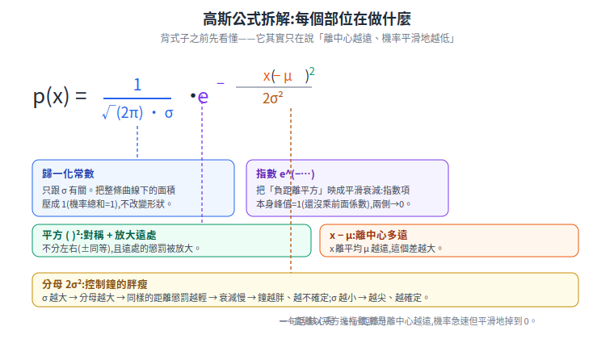</p>

很多人背這條式子卻不知它從哪來。其實有兩條獨立的「第一性原理」都會逼出同一條式子,這正是高斯無所不在的根本原因:

**路徑 A:最大熵——「假設最少」原則。**
假設你對一個量「只知道它的平均和變異數,其他一無所知」。在所有「平均=μ、變異數=σ²」的分布裡,哪一個**最誠實、最不偷塞額外假設**?資訊論的答案是:熵(不確定性)最大的那個。把這個最佳化問題解出來(限定在整條實數軸上、只固定一階與二階矩),得到的就是上面那條式子。**高斯 = 在「只知道平均和變異數」前提下,最不自作主張的分布。** 這就是為什麼「沒有額外資訊時,預設高斯」是合理的。

<p align="center">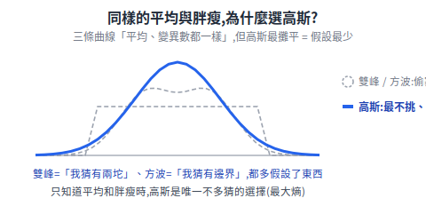</p>

**路徑 B:中央極限定理(CLT)——「很多小隨機疊加」。**
拿任意一堆獨立的隨機小擾動(各自什麼形狀都行),把它們加起來,總和的分布會**趨近高斯**,而且加的項越多越像。現實的量測誤差正是這樣來的:溫度漂移 + 電路噪聲 + 機械震動 + 量化誤差……一堆獨立小因素相加 → 天生接近高斯。**這就是為什麼真實感測器噪聲拿高斯建模最貼切。**

<p align="center">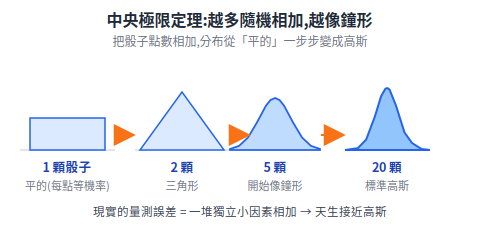</p>

核心式子裡的關鍵是 `e^(−距離²)`:離中心越遠,機率以「距離平方」的速度急速但平滑地衰減。`σ` 控制衰減多快(鐘多胖),前面的 `1 / (√(2π)·σ)` 只是讓整條曲線下面積 = 1(機率總和為 1)的歸一化係數。

### 1.3 多維高斯:均值向量 + 協方差矩陣(這裡接上 3DGS)

機器人位置是 (x, y),3D 場景的點是 (x, y, z)——是**多維**的。多維高斯把:

- 「平均值 μ」升級成**均值向量**(中心在哪)。
- 「變異數 σ²」升級成**協方差矩陣 Σ**(covariance matrix)——它同時描述每個維度各自的散布,以及維度之間的相關性。

協方差矩陣有個關鍵的幾何意義:**它畫出一個橢球**。

<p align="center">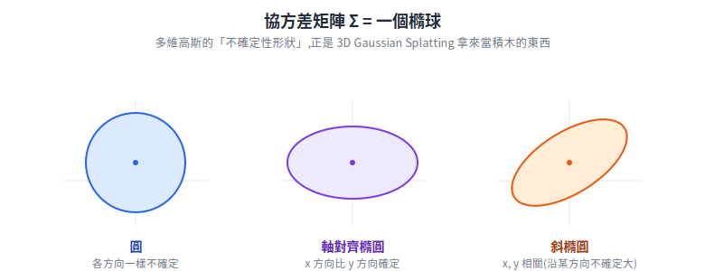</p>

那「Σ 怎麼算出這個橢球」?把 Σ 做**特徵分解**(`Σ = R Λ Rᵀ`):特徵向量就是橢圓兩根軸「指的方向」,特徵值 `λ` 是沿那個方向的變異數,半軸長 = `√λ`。一個嚇人的矩陣,其實只在講「軸朝哪、軸多長」兩件事:

<p align="center">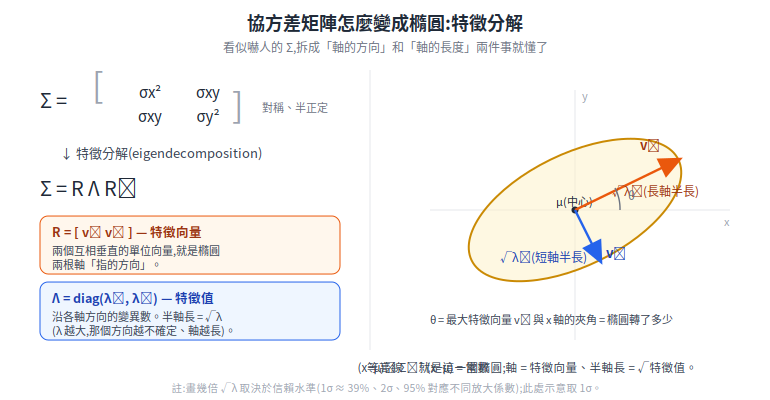</p>

**這個「協方差矩陣 = 一個橢球」,就是 3D Gaussian Splatting 拿高斯當積木的原因**(後面 3.5 詳述):一個 3D 高斯天生就是一顆可大可小、可旋轉拉長的橢球,正好拿來貼合物體表面。

---

## 第二部:高斯的四條「超能力」性質

下面所有應用,全部建立在這四條性質上。先把它們單獨講清楚,後面就只是「在不同問題裡套用哪一條」。

| # | 性質 | 白話 |
|---|---|---|
| **P1** | 只需兩個參數 | 一個高斯完全由 (μ, Σ) 決定,存它、傳它、算它都極省 |
| **P2** | 仿射變換後仍是高斯 | 高斯隨機變數做仿射運算(乘矩陣、投影、相加再平移),結果還是高斯 |
| **P3** | 兩高斯相乘 → 高斯 | 兩個高斯密度相乘,正規化後還是高斯(**資訊融合**的根) |
| **P4** | 兩高斯卷積 → 高斯 | 兩個高斯做卷積,結果還是高斯(**模糊/擴散**的根) |

### 四條性質的數學形式

**P1 — 只需兩個參數。** 一個 `d` 維高斯完全由均值向量 `μ` 與協方差矩陣 `Σ` 決定:

$$ \mathcal{N}(x;\mu,\Sigma)=\frac{1}{(2\pi)^{d/2}\,|\Sigma|^{1/2}}\exp\!\left(-\tfrac{1}{2}(x-\mu)^{\top}\Sigma^{-1}(x-\mu)\right) $$

參數量固定:`μ` 有 `d` 個、`Σ` 有 `d(d+1)/2` 個,跟看過多少資料無關。

**P2 — 仿射變換後仍是高斯。** 若 `x ~ N(μ, Σ)`,對任意矩陣 `A`、向量 `b`:

$$ y = Ax + b \;\Longrightarrow\; y\sim\mathcal{N}\!\left(A\mu+b,\;A\Sigma A^{\top}\right) $$

<p align="center">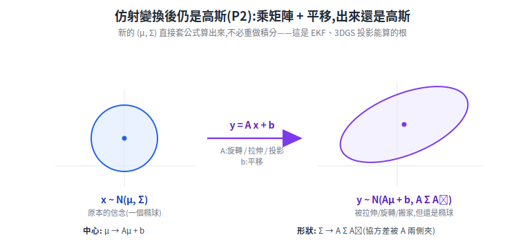</p>

新的 `(μ, Σ)` 直接套公式算出,不必重做積分。取部分分量(邊際化)就是拿一個挑選矩陣當 `A`,所以邊際分布也照這條走。

**P3 — 兩高斯相乘 → 高斯(資訊融合的根)。** 兩個高斯密度相乘、正規化後仍是高斯。一維:`N(μ₁,σ₁²) · N(μ₂,σ₂²) ∝ N(μ,σ²)`,且

$$ \frac{1}{\sigma^{2}}=\frac{1}{\sigma_1^{2}}+\frac{1}{\sigma_2^{2}},\qquad \frac{\mu}{\sigma^{2}}=\frac{\mu_1}{\sigma_1^{2}}+\frac{\mu_2}{\sigma_2^{2}} $$

用**精度**(變異數的倒數)相加,結果更尖、更確定——這正是卡爾曼更新。多維就是資訊矩陣相加:`Σ⁻¹ = Σ₁⁻¹ + Σ₂⁻¹`、`Σ⁻¹μ = Σ₁⁻¹μ₁ + Σ₂⁻¹μ₂`。

帶數字看一遍最清楚——兩個估計 A、B 相乘融合,精度相加、均值被拉向比較確定的那個:

<p align="center">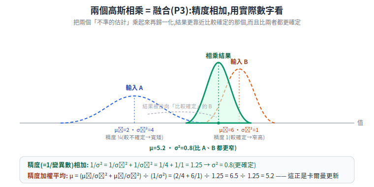</p>

**P4 — 兩高斯卷積 → 高斯(模糊 / 擴散的根)。** 等價於兩個獨立高斯隨機變數相加 `z = x + y`,均值與變異數各自相加:

$$ \mathcal{N}(\mu_1,\Sigma_1)*\mathcal{N}(\mu_2,\Sigma_2)=\mathcal{N}\!\left(\mu_1+\mu_2,\;\Sigma_1+\Sigma_2\right) $$

對照 P3:**相乘是精度相加(變窄),卷積是變異數相加(變胖)**,一條收斂、一條擴散。

> 這四條合起來的意思是:**高斯對「特定的線性 / 高斯操作」是封閉的**——仿射變換、(密度)相乘+正規化、卷積、邊際化、條件化,做完出來還是高斯,於是可以一路用 (μ, Σ) 解析地算下去,不會越算越複雜。這是高斯在工程上壓倒性好用的數學底層。
>
> 注意「封閉」只對上述這幾類操作成立,**不是萬能**:一般非線性變換、兩個高斯隨機變數相乘、取絕對值等都會破壞高斯性。這正是 EKF(§3.2)要先把非線性「就地拉直」成線性、才能套高斯公式的原因。

P3 和 P4 容易混:
- **相乘 = 「兩個獨立意見取交集」** → 結果更尖、更確定(融合兩個感測器 → 更準)。
- **卷積 = 「把不確定性抹開」** → 結果更胖、更模糊(誤差傳遞、影像模糊)。

<p align="center">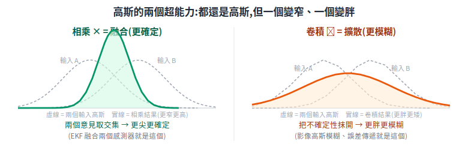</p>

---

## 第三部:用這四條,從頭理解五個演算法

### 3.1 高斯模糊(Gaussian Blur)— 用 P4

**問題**:影像去噪/柔化,要把每個像素和鄰居「平均」一下。怎麼平均最自然?

**第一性原理**:給鄰居的權重,該「越近越重、越遠越輕,且平滑過渡」。高斯函數正好是這種權重核(kernel)。模糊一張圖 = 影像和一個高斯核做**卷積**:

```
新像素 = Σ (鄰居像素 × 高斯權重)
        鄰居權重 = 中心高、四周隨距離平方平滑衰減
```

**為什麼非高斯不可**,而不是隨便的平均核:
- **各向同性**:2D 高斯各方向對稱,模糊不會有方向性瑕疵。
- **可分離**:2D 高斯卷積 = 先做一次水平 1D 高斯,再做一次垂直 1D 高斯(因為 `e^(−(x²+y²)) = e^(−x²)·e^(−y²)`),運算量從 O(n²) 降到 O(n),快很多。
- **P4 的體現**:對影像連續做兩次高斯模糊 = 做一次更大的高斯模糊(兩高斯卷積還是高斯)。所以模糊程度可疊加、可預測,這也是影像金字塔、尺度空間(SIFT 等)的數學基礎。

### 3.2 卡爾曼濾波 / EKF — 用 P1 + P2 + P3(機器人定位的核心)

**問題**:機器人不知道自己確切在哪,只有「會漂移的 odometry」和「有噪聲的感測器」。怎麼把兩個都不準的東西融成一個更準的估計?

**第一性原理**:把「我對自己位置的信念」表示成一個高斯——均值=最可能的位置,協方差=有多不確定(P1,只要存這兩個)。然後反覆兩步:

```
① 預測(Predict):車動了 → 用運動模型推進信念
   位置高斯經過運動(線性近似)→ 仍是高斯(P2)
   但加入了過程噪聲 → 協方差變大(更不確定,P4 擴散)

② 更新(Update):來了一筆感測量測 → 修正信念
   「先驗信念高斯」 × 「量測似然高斯」 → 後驗高斯(P3 相乘)
   結果均值被拉向量測、協方差變小(更確定)
```

整個卡爾曼濾波,本質就是**「P2 推進 → P3 融合」反覆跑**,而且因為全程都是高斯,只需要更新 (μ, Σ) 兩個量,公式封閉、可即時運算。

**EKF(Extended Kalman Filter,擴展卡爾曼濾波)**:真實的運動和感測模型常是非線性的(P2 只對線性成立)。EKF 的招數很單純:**在當前估計點附近,用一階泰勒展開把非線性函數「就地拉直」成線性**,然後照樣套上面的高斯公式。這就是「為什麼有了 KF 還要 EKF」——把非線性問題硬塞回高斯的線性框架。

<p align="center">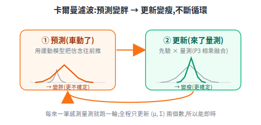</p>

> 接回筆記:[定位](../30-navigation/localization.md) 裡 `robot_localization` 的 EKF 融合 odometry + IMU,跑的就是這套;AMCL 的粒子濾波則是「當分布太怪、高斯裝不下時」改用一堆粒子來表示信念的替代方案。

### 3.3 高斯過程(Gaussian Process, GP)— 用 P2 的極致 + 條件高斯

**問題**:我量了幾個點的函數值(例如幾個位置的訊號強度),想預測沒量過的地方,**還要知道預測有多不確定**。

**第一性原理**:把「一整條未知函數」看成一個**無限維的高斯**。聽起來玄,操作上很實在——GP 的定義是:**函數在任意有限組輸入點上的值,服從一個聯合多維高斯**,點與點之間的相關性由一個「核函數」決定(通常又是高斯核:越近的輸入,函數值越相關)。

預測新點時,用的就是高斯的另一條好性質:**聯合高斯的條件分布還是高斯**。已知幾個觀測點,「在新點的值」這個條件分布算出來,直接給你:
- 條件均值 → 預測值
- 條件變異數 → 不確定性(離觀測點越遠,變異數越大,自動「我不確定」)

GP 之所以迷人,正是這個「附帶誤差條的預測」——而它能解析算出來,全靠高斯的封閉性。

<p align="center">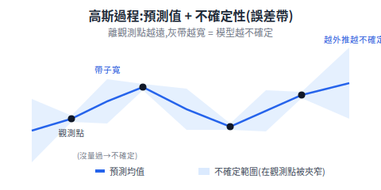</p>

### 3.4 高斯混合模型(Gaussian Mixture Model, GMM)— 承認「單一高斯不夠」

**問題**:真實資料常常不是單峰鐘形,而是好幾坨(例如一張地圖上人群聚在三個區域)。單一高斯(只有一個峰)裝不下。

**第一性原理**:**用 K 個高斯加權疊起來,逼近任意複雜的分布**。

```
p(x) = w₁·N(μ₁,Σ₁) + w₂·N(μ₂,Σ₂) + ... + w_K·N(μ_K,Σ_K)
       (權重 w 加總為 1,每坨一個高斯)
```

這是「高斯是好用的積木」的另一種體現:單塊太簡單,就用多塊拼。怎麼從資料反推每塊高斯的 (μ, Σ, w)?用 **EM 演算法**(Expectation-Maximization)反覆做「猜每個點屬於哪坨 → 用歸屬重算每坨參數」直到收斂。GMM 用在分群、背景建模、語音等。

> 對照:3DGS(下一節)其實就是「**幾百萬塊高斯的混合**」,只是混的不是機率而是空間中的顏色與密度——同一個積木思想。

### 3.5 3D Gaussian Splatting(3DGS)— 用 P1 + P2 + 1.3 的橢球

**問題**:從一堆照片重建出 3D 場景,還要能即時 render(見 [3D 重建那篇](../50-physical-ai/sensor-data-and-3d-reconstruction.md))。

**第一性原理**:把整個 3D 場景表示成**幾百萬個 3D 高斯**,每個高斯是一顆「會發光的橢球」:

```
一個 3D 高斯 = μ(中心位置,3 維)
             + Σ(協方差矩陣 = 橢球的形狀/大小/朝向,見 1.3)
             + 顏色 + 透明度 α
```

為什麼用高斯而不是別的形狀,關鍵又回到那幾條性質:

- **(1.3 的橢球)**:協方差矩陣天生就是橢球,可大可小、可旋轉拉長,正好貼合各種表面。一塊一塊堆起來就是 GMM 式的「拼出整個場景」。
- **(P2:投影後仍是高斯)**:render 時要把 3D 高斯投影到 2D 相機畫面。投影是(近似)線性運算,**3D 高斯投影下來還是 2D 高斯**——畫面上就是一個糊開的橢圓小斑點,叫一個 "splat"。於是可以直接用 GPU rasterization 把幾百萬個 splat 快速畫出來並做 α 混合,**不必像 NeRF 那樣每個像素射光線去積分** → 這就是 3DGS 能即時的根本原因。
- **(平滑可微)**:高斯處處可微,所以可以「對照片算誤差 → 反向傳播 → 用梯度下降微調每顆高斯的 μ、Σ、顏色」,讓重建出來的場景越來越像真實照片。

所以 3DGS 不是憑空冒出的新魔法,而是「**1.3 的橢球 + P2 的投影封閉性 + 可微優化**」三者的組合。

---

## 第四部:一張圖收束——誰用了哪條

<p align="center"></p>

| 演算法 | 核心問題 | 用到的高斯性質 |
|---|---|---|
| 高斯模糊 | 平滑/去噪 | P4 卷積、可分離、各向同性 |
| 卡爾曼/EKF | 融合多感測器做定位 | P1 兩參數、P2 線性推進、P3 相乘融合 |
| 高斯過程 GP | 帶不確定性的函數預測 | P2、條件高斯仍是高斯 |
| GMM | 逼近複雜多峰分布 | 高斯當積木疊加(混合) |
| 3D Gaussian Splatting | 3D 重建 + 即時 render | 1.3 橢球、P2 投影仍高斯、可微優化 |

**一句話總結**:高斯之所以反覆出現,是因為它同時是「**最像真實雜訊**(CLT)+ **假設最少**(最大熵)+ **數學最好算**(對線性操作封閉,P1–P4)+ **幾何上是橢球**(好當積木)」。每個演算法只是挑了這幾條性質裡最對它胃口的,用同一塊料,做出不同的菜。

---

## 來源 / 延伸

- 概念為機率論與機器學習通識(最大熵、中央極限定理、卡爾曼濾波、GP、GMM、3DGS),屬教科書層級共識。
- 3DGS 的工程性質對照 [NVIDIA — 3D Reconstruction (glossary)](https://www.nvidia.com/en-us/glossary/3d-reconstruction/)。
