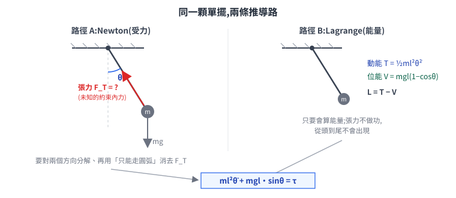
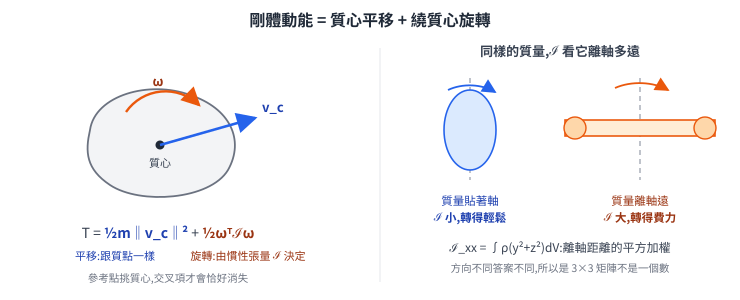
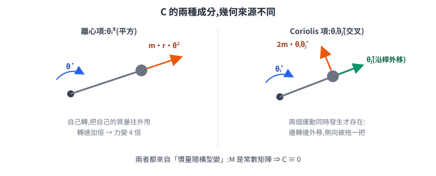
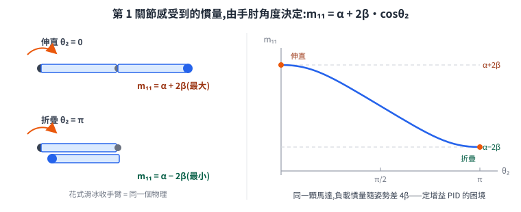
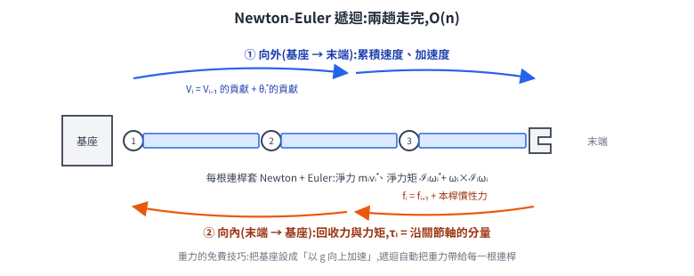
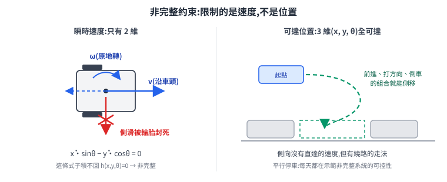
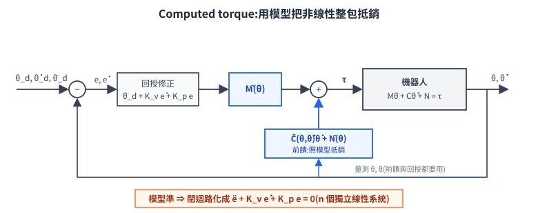

# 機器人動力學:力怎麼變成運動,運動又要花多少力

到目前為止,整本筆記談運動幾乎都停在**運動學**:給關節角算末端在哪(FK)、給輪速算車體速度(差速運動學)、給目標位姿回推關節角(IK)。這些全是**幾何**問題——「在哪裡」「往哪動」,一個「力」字都沒出現。

但馬達實際輸出的不是位置也不是速度,是**力矩**。中間缺的那一段——「出多少力矩,會產生什麼運動;想要某個運動,得出多少力矩」——就是**動力學(dynamics)**。這篇從 F = ma 一路推到機器人動力學的標準形式:

$$ M(\theta)\ddot{\theta} + C(\theta,\dot{\theta})\dot{\theta} + N(\theta) = \tau $$

推完你會看到:這條式子不是新物理,它就是 F = ma 換到關節座標之後**必然長出來的樣子**;三項各有明確的物理身分;而且它帶著幾條結構性質,整個機器人控制理論都蓋在那幾條性質上。

> 前置:[手臂運動學](../20-forms/mobile-manipulator/arm-kinematics.md)(關節空間/工作空間、Jacobian)、[座標轉換與 TF](../10-core/30-navigation/kinematics-and-coordinate-transforms.md)(剛體變換)。高中程度的 F = ma 與動能位能即可,其餘從零推。
> 延伸:[足式的根本分岔](../20-forms/legged/legged-fundamentals.md)(接觸切換的混合動力學)、[下位機運動控制](../10-core/20-firmware/low-level-control.md)(PID 速度環)、[路徑平滑與軌跡生成](../10-core/30-navigation/path-smoothing-and-trajectory.md)(軌跡的加速度上限從哪來)。

---

## 1. 運動學什麼時候不夠用

先誠實回答一個問題:這本筆記寫到第六十幾篇才碰動力學,前面的輪式 AMR 為什麼活得好好的?

因為**速度環把動力學藏起來了**。上位機發 `(v, ω)`,下位機的 PID 速度環負責「不管負載多重、坡度多少,把輪速拉到指定值」——力矩該出多少,是 PID 靠誤差**當場試出來**的,不是靠模型**算出來**的。低速、輪式、不碰東西的場景,這招夠用,所以導航層可以假裝機器人是一個「給速度就照走」的質點。

三種場景會讓這招失效,動力學就得浮上檯面:

| 場景 | 為什麼藏不住 |
|---|---|
| **手臂快速運動** | 連桿之間慣性耦合:第 2 關節加速會把第 1 關節「甩」出去。單關節 PID 把耦合當成未知干擾硬扛,速度一快就扛不住,軌跡精度崩掉 |
| **接觸與力控**(打磨、插裝、抓取) | 任務本身就是「出多少力」,不談力的框架連問題都寫不出來 |
| **模擬** | 物理引擎每一步算的就是「給力,求運動」——正動力學。想知道 Gazebo/Isaac 在算什麼,就是在算這篇的式子 |

四足與人形更徹底:腳每次觸地都改變動力學方程本身([混合系統](../20-forms/legged/legged-fundamentals.md)),而且靜態站著不動也需要持續算力矩來平衡——動力學不是進階選配,是入場券。

**兩個方向,兩種用途**,先把詞定好:

| 詞 | 問題 | 誰在用 |
|---|---|---|
| **逆動力學(inverse dynamics)** | 給定想要的運動 `θ(t), θ̇(t), θ̈(t)`,求所需力矩 `τ` | 控制器(算前饋)、軌跡可行性檢查(超不超過馬達額定力矩) |
| **正動力學(forward dynamics)** | 給定力矩 `τ` 與當下狀態,求加速度 `θ̈` | 模擬器(積分出下一刻狀態) |

方向相反,但兩者用的是同一條方程——就是開頭那條。接下來把它推出來。

---

## 2. 同一個問題的兩條路:Newton vs Lagrange

推運動方程有兩套辦法,結果保證相同,但走起來的體感差很多。拿一顆單擺(質量 `m`、無質量桿長 `l`、鉸點加力矩 `τ`)當試金石:

**路徑 A:Newton。** 對質點寫 F = ma。但質點受的力除了重力,還有**桿子的張力**——一個方向已知、大小未知的約束力(constraint force)。你得把它設成未知數、對兩個方向分解、再用「質點只能走圓弧」這個幾何條件把它消掉。一顆單擺就要多解一個未知量;換成六軸手臂,每個關節都藏著一組這樣的內力。

**路徑 B:Lagrange。** 換一種問法:不問「受什麼力」,只問「能量是多少」。挑一個能完全描述姿勢的座標(這裡就是擺角 `θ`),寫出動能 `T` 與位能 `V`:

$$ T = \tfrac{1}{2}ml^2\dot{\theta}^2, \qquad V = mgl(1-\cos\theta), \qquad L = T - V $$

`L` 叫 **Lagrangian(拉格朗日函數)**,運動方程直接由一條固定程序生出來:

$$ \frac{\mathrm{d}}{\mathrm{d}t}\frac{\partial L}{\partial \dot{\theta}} - \frac{\partial L}{\partial \theta} = \tau $$

代進去:`∂L/∂θ̇ = ml²θ̇`,對時間微分得 `ml²θ̈`;`∂L/∂θ = −mgl·sinθ`。所以:

$$ ml^2\ddot{\theta} + mgl\sin\theta = \tau $$

張力從頭到尾**沒有出現**。這不是運氣,是 d'Alembert 原理:**理想約束力不做功**——張力永遠垂直於質點的運動方向,對能量沒有貢獻,而 Lagrange 方法只看能量,所以它天生看不到約束力。這正是它適合機器人的原因:一台 n 關節的手臂有幾十個關節內力,Lagrange 方法讓你完全不必理它們,只要會算能量,n 個關節就得到 n 條乾淨的方程。

> 那 Newton 路線是不是就沒用了?不是——它換個形式(逐連桿遞迴)反而是**控制器裡實際在跑**的算法,§7 再回來。粗略分工:**理解結構、推公式用 Lagrange;即時數值計算用 Newton-Euler**。

---

## 3. 廣義座標:為什麼 n 個關節角就是全部

單擺我們「自然地」挑了 `θ` 當座標。把這件事說清楚,就是**廣義座標(generalized coordinates)**的概念。

一根自由飛行的剛體有 6 個自由度(3 平移 + 3 旋轉),n 根連桿的手臂照理有 `6n` 個。但連桿不是自由的:每個轉動關節都規定「這兩根連桿只能繞這根軸相對轉動」——一個關節吃掉 5 個自由度,只留 1 個。這種「把構型限制在某個曲面上」的約束叫**完整約束(holonomic constraint)**,可以寫成位置的方程 `h(q) = 0`(§8 會遇到寫不成這樣的另一種)。全部關節約束一起作用,`6n` 維被砍到只剩 **n 維:每個關節一個角度**。

所以 `θ = (θ₁, …, θₙ)` 不是「方便的簡寫」,它是**這台機器所有可能姿勢的完整座標**——知道 n 個關節角,每一根連桿在哪就完全確定(這正是 FK 在算的事)。對這組座標,Lagrange 方程逐關節各寫一條:

$$ \frac{\mathrm{d}}{\mathrm{d}t}\frac{\partial L}{\partial \dot{\theta}_i} - \frac{\partial L}{\partial \theta_i} = \tau_i, \qquad i = 1,\dots,n $$

`τᵢ` 是第 i 關節馬達出的力矩。剩下的工作只有一件:把一台真實機器人的 `T` 與 `V` 寫出來。位能簡單(每根連桿 `mᵢg·hᵢ(θ)` 相加),難的是動能——那需要先弄清楚**一根剛體的動能長什麼樣**。

---

## 4. 剛體的動能:平移、旋轉,與慣性張量

質點的動能是 `½m‖v‖²`。剛體上每個點速度都不一樣,動能是對整個體積的積分——但只要把參考點挑在**質心**,積分會乾淨地裂成兩半:

$$ T = \underbrace{\tfrac{1}{2}m\|v_c\|^2}_{\text{質心平移}} \;+\; \underbrace{\tfrac{1}{2}\,\omega^{\top}\mathcal{I}\,\omega}_{\text{繞質心旋轉}} $$

(交叉項含有「各點對質心的位置加權平均」,而質心的定義正是讓這個平均為零——所以挑質心不是習慣,是**讓交叉項消失的唯一選擇**。)

第二項的 `ℐ` 是**慣性張量(inertia tensor)**,一個 3×3 對稱矩陣,元素是質量分布的二階矩:

$$ \mathcal{I}_{xx} = \int \rho\,(y^2+z^2)\,\mathrm{d}V, \qquad \mathcal{I}_{xy} = -\int \rho\, x y\,\mathrm{d}V, \;\dots $$

它回答的問題是:「這塊質量分布,繞各個方向轉起來有多費力」。為什麼是矩陣而不是一個數?因為**答案跟軸的方向有關**:同樣一根長棒,繞自己長軸轉很輕鬆(質量都貼著軸),橫著轉很費力(質量離軸遠)——`(y²+z²)` 正是「離 x 軸的距離平方」,離軸越遠的質量貢獻越大。非對角項則記錄「繞這根軸轉,會不會順便把別的軸也帶起來」的耦合。

算一個具體的:密度均勻、邊長 `l × w × h` 的長方體,對質心沿邊方向的軸:

$$ \mathcal{I} = \frac{m}{12}\begin{bmatrix} w^2+h^2 & & \\ & l^2+h^2 & \\ & & l^2+w^2 \end{bmatrix} $$

每個對角元都是「**另外兩個**方向的尺寸平方和」——再次印證:繞 x 轉費不費力,只看質量在 y、z 方向攤多開,跟 x 方向多長無關。工程上你幾乎不會手算這個積分:CAD 軟體直接給,或用「長方體/圓柱近似 + 平行軸定理」湊;URDF/SDF 裡每根 link 填的 `<inertia>` 就是這 6 個獨立元素(對稱矩陣,3 個對角 + 3 個非對角)。

把平移與旋轉合起來,一根剛體的動能可以寫成一個 6×6 的**廣義慣量矩陣(generalized inertia matrix)**作用在 6 維速度(3 線速度 + 3 角速度)上:

$$ T = \tfrac{1}{2} V^{\top} \begin{bmatrix} mI_{3\times3} & 0 \\ 0 & \mathcal{I} \end{bmatrix} V, \qquad V = \begin{bmatrix} v_c \\ \omega \end{bmatrix} $$

一根連桿的「慣性身分證」就這 10 個數:質量 1 個、質心位置 3 個、慣性張量 6 個。整台機器人的動力學,原料只有每根連桿的這 10 個數加上幾何。

---

## 5. 組裝:M(θ)θ̈ + C(θ,θ̇)θ̇ + N(θ) = τ 是怎麼長出來的

現在把 n 根連桿組成手臂。關鍵觀察:**每根連桿的 6 維速度,都是關節速度的線性函數**——這正是 [Jacobian](../20-forms/mobile-manipulator/arm-kinematics.md) 做的事,只是這次不是只對末端,而是對每一根連桿(的質心)各有一個:

$$ V_i = J_i(\theta)\,\dot{\theta} $$

把每根連桿的動能加起來:

$$ T = \sum_{i=1}^{n} \tfrac{1}{2} V_i^{\top} M_i V_i = \tfrac{1}{2}\,\dot{\theta}^{\top}\underbrace{\Big(\sum_{i} J_i^{\top}(\theta)\, M_i\, J_i(\theta)\Big)}_{M(\theta)}\,\dot{\theta} $$

`M(θ)` 是 n×n 的**慣量矩陣(inertia matrix / mass matrix)**。注意它**依賴構型 θ**:Jacobian 隨姿勢變,所以「這台機器轉起來多費力」隨姿勢變。這一個事實,就是整條動力學方程裡所有「怪項」的唯一來源。

把 `T = ½θ̇ᵀM(θ)θ̇` 與 `V(θ) = Σmᵢg·hᵢ(θ)` 代進 Lagrange 方程,乖乖做微分(過程只是連鎖律,不需要新想法),整理出來就是:

$$ M(\theta)\ddot{\theta} \;+\; C(\theta,\dot{\theta})\dot{\theta} \;+\; N(\theta) \;=\; \tau $$

| 項 | 物理身分 | 從哪裡冒出來 |
|---|---|---|
| `M(θ)θ̈` | 慣性力:加速本身要花的力 | `d/dt(∂T/∂θ̇)` 裡對 `θ̇` 微分的部分 |
| `C(θ,θ̇)θ̇` | 離心力 + Coriolis 力 | **`M` 隨 `θ` 變化**——微分時連鎖律掃到 `M(θ)` 產生的所有項 |
| `N(θ)` | 重力 | `∂V/∂θ` |

`C` 值得多看一眼,因為它是三項裡最不直觀的。它的元素由 `M` 對 `θ` 的偏導組合而成(這個特定組合叫 Christoffel 符號):

$$ C_{ij}(\theta,\dot\theta) = \frac{1}{2}\sum_{k=1}^{n}\left( \frac{\partial M_{ij}}{\partial \theta_k} + \frac{\partial M_{ik}}{\partial \theta_j} - \frac{\partial M_{kj}}{\partial \theta_i} \right)\dot{\theta}_k $$

式子不用背,要抓住的是結構:**如果 `M` 是常數矩陣,`C` 整個是零**。離心力與 Coriolis 力不是額外的新力,它們是「慣量隨姿勢變化」在方程裡的倒影。其中速度平方項(`θ̇ᵢ²`)叫**離心項**,交叉項(`θ̇ᵢθ̇ⱼ, i≠j`)叫 **Coriolis 項**:

### 5.1 具體看一台:平面二連桿

平面 2-DOF 手臂(連桿長 `l₁, l₂`,質心距關節 `r₁, r₂`)的慣量矩陣算出來是:

$$ M(\theta) = \begin{bmatrix} \alpha + 2\beta\cos\theta_2 & \delta + \beta\cos\theta_2 \\ \delta + \beta\cos\theta_2 & \delta \end{bmatrix} $$

其中 `α, δ` 是由質量與慣性張量湊出的常數,`β = m₂l₁r₂`。看第一格:**第 1 關節感受到的慣量 `m₁₁ = α + 2βcosθ₂`,由手肘角度 `θ₂` 決定**——手臂伸直(`θ₂ = 0`)時最大,完全折疊(`θ₂ = π`)時最小,差距是 `4β`:

這就是花式滑冰選手收手臂會轉更快的那個物理,只是這裡角色對調:滑冰是慣量變小、角動量不變、轉速上升;手臂控制是同一顆馬達,面對的負載慣量隨姿勢差好幾倍。**單關節定增益 PID 在這裡的困境現在看得很清楚**:對伸直姿勢調好的增益,到折疊姿勢就過衝;而且非對角項 `m₁₂ ≠ 0` 說明兩關節慣性耦合——第 2 關節加速,第 1 關節即使不動也會被拖出力矩。這些不是干擾,是方程的正文。

---

## 6. 三條結構性質:機器人控制蓋在這上面

這條方程不只是「能算」,它帶著幾條**不依賴具體機器**的結構性質。控制理論用的是這些性質,不是那一大串具體係數。

**P1 — `M(θ)` 對稱且正定。** 理由一句話:`½θ̇ᵀM(θ)θ̇` 是動能,而動能對任何非零速度都嚴格為正。正定保證 `M⁻¹` 永遠存在——正動力學 `θ̈ = M⁻¹(τ − Cθ̇ − N)` 永遠解得出來,模擬器不會除以零。

**P2 — `Ṁ − 2C` 反對稱(skew-symmetric)。** 這條看起來最技術,其實是**能量守恆的化身**。對動能求時間導數:

$$ \dot{T} = \dot{\theta}^{\top}(\tau - N) + \tfrac{1}{2}\,\dot{\theta}^{\top}\big(\dot{M} - 2C\big)\dot{\theta} $$

反對稱矩陣對任何向量 `x` 都有 `xᵀAx = 0`,所以第二項恆為零,剩下:**動能的變化率 = 馬達注入的功率 − 抬升位能的功率**。翻譯:離心力與 Coriolis 力**不做功**——它們改變運動方向、在關節之間搬運能量,但不創造也不消耗能量。這條性質是 §9 裡 PD 控制穩定性證明的關鍵一步,也是 adaptive control 的基石。(嚴格說 `C` 的定義有多種等價寫法,反對稱性是對上面 Christoffel 那個特定寫法成立;能量等式本身則對哪種寫法都對。)

**P3 — 方程對慣性參數是線性的。** 把每根連桿的 10 個慣性參數(§4 結尾那張身分證)集中成向量 `π`,方程可以改寫成:

$$ M(\theta)\ddot{\theta} + C(\theta,\dot{\theta})\dot{\theta} + N(\theta) = Y(\theta,\dot{\theta},\ddot{\theta})\,\pi $$

`Y` 只含幾何與運動(全部可量測),`π` 只含慣性參數。方程對 `θ` 高度非線性,**對 `π` 卻是線性的**——所以參數辨識是線性回歸:讓手臂跑一段激勵軌跡,錄下 `(θ, θ̇, θ̈, τ)`,最小二乘解出 `π`。§9 的 adaptive control 也靠它:參數不準就讓 `π̂` 在線上自己收斂。

---

## 7. Newton-Euler 遞迴:控制器裡實際在跑的版本

§2 說 Newton 路線會回來——它回來的形式是**遞迴**。Lagrange 給的是閉式(closed-form)方程,適合分析;但把六軸手臂的 `M, C, N` 符號化展開,是上千項三角函數的怪物,而控制器每 1 毫秒就要算一次逆動力學。Newton-Euler 遞迴演算法(RNEA)換一種計算安排:**不展開任何式子,順著結構把數字傳兩趟**:

- **向外(基座 → 末端)**:第 i 根連桿的速度、加速度 = 第 i−1 根的,加上第 i 關節自己的貢獻。逐桿累積,一趟到底。
- **逐桿套用 Newton 與 Euler 方程**:這根連桿要這樣加速,需要淨力 `mᵢv̇` 與淨力矩 `ℐω̇ + ω×ℐω`。
- **向內(末端 → 基座)**:第 i 關節要撐住「第 i 根連桿自己的慣性力 + 外側整串傳回來的力」。逐桿回收,把每根關節軸方向的分量取出來,就是 `τᵢ`。

兩趟各 n 步,計算量 **O(n)**——六軸手臂實際只要幾百次乘加,MCU 上跑 1 kHz 輕鬆。§2 遇到的「關節內力」在這裡不是麻煩而是主角:向內那趟傳遞的就是它們,只是全部用數值進出,不必符號求解。還有一個漂亮的工程細節:**重力不必逐桿加**——把基座的初始加速度設成「以 g 向上加速」,整串遞迴就自動把重力算進每一根連桿(電梯裡的等效原理,拿來當程式技巧)。

| | Lagrange 閉式 | Newton-Euler 遞迴 |
|---|---|---|
| 產出 | 符號方程(看得到 `M, C, N` 結構) | 數值 `τ`(結構隱在遞迴裡) |
| 適合 | 分析、證明、理解 | 即時控制、任何 n |
| 計算量 | 符號展開隨 n 爆炸 | O(n) |

兩者是**同一組物理的兩種計算安排**,不是兩種理論——對同一台機器、同一個運動,算出的 `τ` 逐位相同。模擬器的正動力學同樣有 O(n) 遞迴解(Featherstone 的 articulated-body 演算法),物理引擎裡跑的就是它。

---

## 8. 帶約束的動力學:輪子、接觸、閉鏈

到這裡處理的都是「自由」的開鏈手臂:n 個關節角想怎麼動就怎麼動。但機器人常常被額外的條件綁住——輪子不能側滑、腳踩地不能穿地、並聯機構的桿要閉合。約束進場的標準寫法是把「速度不准往某些方向」寫成:

$$ A(q)\,\dot{q} = 0 $$

同時方程右邊多出一項**約束力** `Aᵀ(q)λ`——地面推腳的正向力、地面擋住輪胎的側向摩擦力,都是它。`λ` 的大小不是給定的,是「恰好維持約束成立」所需的量,與運動一起解出來。

約束分兩種,差別在**能不能積分回位置的方程**:

- **完整(holonomic)**:`A(q)q̇ = 0` 可以積回 `h(q) = 0`——約束的其實是**位置**,構型空間真的變小。關節本身、閉鏈機構屬於這種。
- **非完整(nonholonomic)**:積不回去——約束的**只有速度,不限制你最終能到哪**。

輪子正是非完整約束的代表。差速底盤的構型是 `(x, y, θ)` 三維,「輪子不側滑」給出一條速度約束:

$$ \dot{x}\sin\theta - \dot{y}\cos\theta = 0 $$

任一瞬間,車只能「沿車頭方向走」加「原地轉」——速度空間只有 2 維。但**側向移動這個「位置」並沒有被禁止**:前進、轉、倒車組合一下照樣挪得過去,路邊平行停車就是日常證據。3 維構型全部可達、瞬時速度卻只有 2 維,「可行速度」與「可達位置」脫鉤——這就是非完整。它解釋了這本筆記前面幾個「當時只給結論」的事實:差速車的[路徑要滿足曲率約束](../10-core/30-navigation/path-smoothing-and-trajectory.md)、[規劃器要用 Hybrid-A* 這類考慮運動學的展開](../10-core/30-navigation/path-planning.md)——根子都是這條積不回去的速度約束。

四足的接觸是另一個量級的麻煩:每隻腳踩地時貢獻一組約束,抬起就消失——**約束集合本身隨步態切換**,每種觸地組合對應一組不同的方程,這正是[足式篇](../20-forms/legged/legged-fundamentals.md)說的混合系統。並聯機構(Delta、Stewart 平台)則是閉鏈約束:多條腿同時抓著末端,方程照 `Aᵀλ` 的路數寫,只是 `λ` 變成腿之間的內力。

---

## 9. 動力學拿來控制:computed torque 與 PD + 重力補償

有了模型,控制的第一個想法很直接:**把非線性整包抵銷掉**。想追軌跡 `θ_d(t)`,令誤差 `e = θ_d − θ`,取:

$$ \tau = M(\theta)\big(\ddot{\theta}_d + K_v\dot{e} + K_p e\big) + C(\theta,\dot{\theta})\dot{\theta} + N(\theta) $$

代回動力學方程,`C`、`N` 對消,`M` 約掉(正定所以可逆,P1 在此上工),閉迴路變成:

$$ \ddot{e} + K_v\dot{e} + K_p e = 0 $$

**一台高度非線性、強耦合的機器,被模型抵銷成 n 個獨立的線性質量-彈簧-阻尼系統**,增益想擺哪個極點就擺哪個。這招叫 **computed torque**(計算力矩,回授線性化的一種)。它同時也回答了「逆動力學拿來幹嘛」:括號外那三項就是沿著期望軌跡算的逆動力學,用 §7 的 RNEA 每毫秒算一次。

漂亮,但有兩個誠實的代價:`M, C, N` 要**即時算**,而且要**算得準**——慣性參數(尤其抓了不明負載之後)實務上很難準。於是第二個問題自然浮現:模型不準、甚至乾脆不用模型,會怎樣?

**答案意外地好:純 PD + 重力補償,就能把「到定點」做到全域穩定**:

$$ \tau = K_v\dot{e} + K_p e + N(\theta) $$

只補一項最容易算準的重力(它只跟幾何與質量有關,不含速度),`M`、`C` 完全不管。為什麼亂成這樣還穩?能量觀點:把 `Kp` 看成拉著關節往目標走的**虛擬彈簧**,`Kv` 是**虛擬阻尼**。系統總能量 = 動能 + 彈簧位能,它的變化率算出來是 `−θ̇ᵀKvθ̇ ≤ 0`——阻尼只會耗能,而中途那些沒被抵銷的離心/ Coriolis 力**不做功**(P2 在此上工),攪不亂能量帳。能量單調下降,最後只能停在彈簧鬆掉的地方——就是目標點。這套「挑一個能量函數、證明它一路下降」的論證是 Lyapunov 方法,機器人控制的大半證明都是這個模子。

工業機械臂的日常大致就停在這附近:定位任務用 PD(+重力補償)級的控制就夠;高速高精軌跡才把 computed torque 的前饋加回來;參數不準的場景,P3 的線性性讓 **adaptive control** 可以邊跑邊修 `π̂`,Lyapunov 函數多加一項參數誤差照樣證得下來。至於四足的 whole-body control,同一套方程,只是 `τ` 要跟接觸力 `λ` 一起解、還要滿足摩擦錐——本篇的框架加上 §8 的約束,就是它的全部語言。

---

## 10. 什麼時候可以不管動力學

最後把最開頭的問題正面收掉:工業手臂用了幾十年單關節 PID、輪式 AMR 整本筆記不談動力學,為什麼都沒出事?每個「可以不管」背後都有一個具體的機制在兜底:

| 場景 | 兜底機制 | 什麼時候破功 |
|---|---|---|
| 大減速比的工業手臂 | 馬達慣量經減速比**平方**放大([反射慣量](../20-forms/legged/gait-and-actuation.md)):減速比 100 時馬達自身慣量 ×10⁴,把「隨姿勢變好幾倍」的連桿慣量淹成小數點,每個關節近似**常慣量、彼此解耦**——單關節 PID 的前提被硬體買回來了 | 高速高精軌跡;直驅/準直驅(QDD)沒有這個平方放大 |
| 輪式 AMR | 下位機速度環把力矩問題就地消化,對上層呈現「給速度就照走」 | 重載、坡道、急加減速時速度環飽和;需要牽引力控制 |
| 低速一切 | 慣性力 ∝ 加速度、離心/Coriolis ∝ 速度平方,慢就小;剩下的重力項不隨速度變,好補 | 一快全回來 |

反過來,**力控、接觸、足式、高速直驅**——動力學從第一天就是主角。判斷準則一句話:**你的控制頻寬內,慣性效應是不是被硬體(減速比)或內環(速度環)吃掉了?是,就能繼續假裝在做運動學;不是,這篇就是你要的那一層。**

---

## 來源與體系說明

本篇的推導骨架與範例(單擺、平面二連桿、性質 P1–P3、Newton-Euler 遞迴、帶約束的 Lagrange)整理自哈爾濱工業大學(深圳)《機器人學導論》課程 [AUTO3005](https://github.com/HITSZ-OpenAuto/AUTO3005)(HITSZ-OpenAuto 開源課程資料,CC BY-SA)所收錄的港科大李澤湘、吳原清 2012 年講義 *A Geometrical Introduction to Robotics and Manipulation* 第 4、5 章,及其主教材 Murray, Li, Sastry, *A Mathematical Introduction to Robotic Manipulation*(CRC Press, 1994)第 4 章。

一個體系上的取捨要交代:該課程全程使用**旋量 / 指數積(PoE)**數學體系,連桿 Jacobian、Newton-Euler 遞迴都以 twist 與伴隨變換(Adjoint)寫出,好處是座標不變、公式對任何機構統一。本篇為了與全書其他篇章(DH 參數、齊次變換)銜接,採**廣義座標**的一般寫法,把旋量機械留給原講義——兩套體系推出的方程相同,差別只在中間符號。讀原版時注意:`ξ` 是關節 twist、`Ad_g` 是伴隨變換、`V^b` 是 body velocity,對應本篇的 `Jᵢ(θ)θ̇`。
