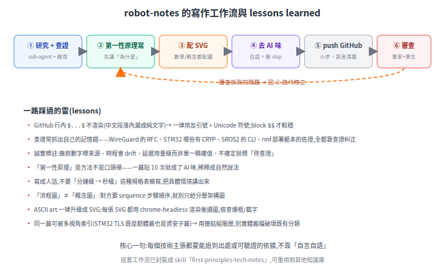

# robot-notes 的寫作慣例與 lessons learned

這個 repo 不只是內容,也累積了一套「怎麼把技術主題寫清楚、寫可信」的工作法。這份記錄它的慣例與一路踩過的雷,讓之後擴展的人(或 agent)能延續同樣的品質,不必重踩。

## 每篇的工作流

1. **研究 + 查證**:動筆前先查。涉及外部事實(API、標準、型號、版本、端點)用 research sub-agent + WebSearch/WebFetch 查官方來源,每個主張附 URL。
2. **第一性原理寫**:先講「為什麼」「在解什麼」,再展開細節;不是直接貼設定檔。
3. **配 SVG**:數學、概念、流程一律配圖。
4. **去 AI 味**:寫成人話,刪掉 AI 痕跡(見下)。
5. **push GitHub**:小步提交,commit 訊息講清楚改了什麼、為什麼。
6. **專家 + 學生審查**:派兩個 sub-agent,一個查技術正確性與出處、一個查可讀性,抓到的問題回第 2 步迭代。

## 一路踩過的雷(lessons)

- **GitHub 的行內 `$...$` 數學常常不渲染**——夾在中文段落裡會漏成純文字(讀者真的看到 `$F_t \le \mu N$` 這串)。改用**反引號 + Unicode 符號**(`μ`、`≤`、`×`、`Σ`、`∫`);獨立成行的 block `$$` 才較穩。

- **查證常抓出自己的記憶錯**。這 repo 修正過的例子:WireGuard 其實**沒有** IETF 標準軌 RFC(誤記成 RFC 9203,那是別的東西);STM32F405/F407 **沒有** CRYP 硬體加速;SROS2 的 CLI 是 `create_enclave` 不是舊的 `create_key`;對 `rmf_deployment_template` 的佐證一度講過頭(範本其實沒那樣設)。**結論:涉及具體事實一律查證,別靠記憶。**

- **誠實標註勝過漂亮話**:廠商效能數字標明來源(別當中立基準)、會變動的時程標日期、延遲這種依條件而定的用量級(LEO 數十 ms / GEO ≥250 ms)而非單一精確值、不確定的標「待查證」。

- **「第一性原理」是方法,不是口頭禪**:有一篇一度出現 10 次「第一性原理」當標籤,讀起來就是 AI 味。精神保留(從根本推導),但把標籤稀釋成自然說法。

- **寫成人話,不要規格表簡寫**:像「分鐘級 → 秒級」「又快又穩又強」這種,改成把具體情境講出來(「改一行要等好幾分鐘、結果還時好時壞」)。

- **「流程圖」不等於「概念圖」**:對方要的是步驟順序(sequence),就別只給分層架構圖——兩者都有價值,但要給對。

- **ASCII art 一律升級成 SVG**,而且每張 SVG 都用 `chrome-headless` 渲染後**讀圖檢查**(爆框、截字、箭頭顏色不一致都靠這抓)。

- **一篇可被多視角索引**:STM32 的 TLS 篇既是「韌體」也是「資安」的子篇——用連結把它組進不同主題的階層,別實體搬檔去破壞既有分類。

- **審查迭代真的會抓到東西**:不只可讀性,還抓過「佐證與現行版本不符」「pseudo 跟真實 API 概念衝突」這類技術問題。每篇 push 後跑一輪值得。

- **概念圖要先找參考、再重繪,不要憑空手繪**:幫廣域連線篇配「車車 + 衛星」概念圖時,一開始憑想像手畫,被退「不夠專業」。正確順序是 **先蒐集參考 → 真的看過 → 再重繪**:用搜尋找真實案例圖 / 官方示意圖 / 新聞配圖,把圖下載到本地實際看過,理解構圖與元素後再畫;可參考專業新聞圖重繪,或用一致的開源素材庫(如 Lucide,ISC 授權)當積木,別自己捏一堆不一致的形狀。版權上以「參考重繪 / 開源素材」為主,別把受版權的新聞圖直接放進 repo。

- **找資料中英文並重,優先在地案例**:同一主題只查英文是偷懶;中文與在地(台灣)案例往往更有說服力,也更貼讀者。例:廣域連線篇補上台灣大哥大 × AST SpaceMobile 的手機直連衛星 MOU(2026-03-02 MWC)、中華電信 IoT-NTN 測試、Ericsson × CJ Logistics 私有 5G 倉儲,比純國外案例更落地。

## 核心一句

**每個技術主張,都要能追到出處、或可被驗證的依據——不靠「自言自語」。** 這是這 repo 跟「看起來合理但沒根據」的內容最大的差別。

## 可重用

這套工作流已封裝成 skill `first-principles-tech-notes`,可套用到其他知識庫專案。
