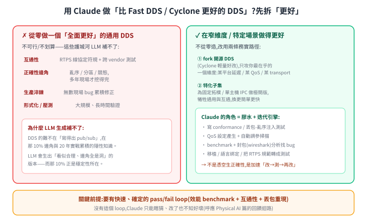

# LLM 能不能重寫一套「比 Fast DDS / Cyclone 更好的 DDS」?

這是讀完 [ROS 2 與 DDS](../40-fleet/ros2-dds-intro.md) 之後很自然會冒出來的問題:協定規格是公開的、程式碼是開源的、AI 又很會寫程式——那為什麼不直接生一套更好的?

答案很能說明**工程軟體的難處到底在哪**,所以獨立成一篇。它跟機器人本身沒有直接關係,是一則關於能力邊界的思考練習。

---

延續上一節「別自造」,這題要誠實拆。「更好」沒有全面版本,先分兩種:

**全面更好的通用 DDS、從零用 Claude 寫 → 不可行也不划算。** DDS 的難不在「寫得出 pub/sub」(上一節 pseudo 就是),而在那 10% 邊角:亂序、網路分區、競態、QoS 完整矩陣、RTPS 跨 vendor 互通——這些是 20 年現場累積的隱性知識。LLM 會生出「看似合理、邊角全是洞」的版本,而那 10% 正是穩定性所在;靠「讀更多文件」補不了,因為這些 bug 是被真實流量打出來的,不是寫在文件裡。

**但在窄維度 / 特定場景做得更好 → 可行,而且這才是 Claude 的正確用法。** 兩條路徑:

- **fork 開源 DDS**(Cyclone 輕量好改),只攻你最在乎的一個維度(某嵌入式平台的延遲、某個 QoS、某 transport),其他照用成熟實作。
- **特化子集**:若你的場景是固定拓樸、單主機 IPC、訊息型別固定,做一個極簡、零配置的特化版,在那個窄場景可能比通用 DDS 更快更簡單——代價是放棄通用性、互通性、完整 QoS。

這兩條裡,**Claude 是膠水 + 迭代引擎,不是憑空生正確性的魔法**(呼應 [Claude Physical AI workflow](../50-physical-ai/claude-physical-ai-workflow.md)):它真正能加速的是 conformance / 丟包注入測試、QoS 自動調參、benchmark + 封包分析找 bug、移植與綁定、把 RTPS 規範條文轉成測試案例。

**關鍵前提還是 pass/fail loop**:要有快速、確定的「效能 benchmark + 互通性測試 + 丟包重現」當訊號,Claude 才知道每次改是變好還變壞;沒有這個 loop,它只能瞎猜。

**結論**:務實的問法不是「Claude 能不能寫一個打敗 Fast DDS 的」,而是「**我的場景在哪個維度需要更好,能不能 fork 成熟 DDS、用 Claude + 嚴格測試 loop 在那個維度做到更好**」。後者答案是肯定的;「全面從零超越」則不是。

---

## 這則練習真正的重點

DDS 這類系統的價值**不在程式碼本身**,而在那些程式碼所編碼的、經年累月踩出來的邊界情況:網路分割時該怎麼辦、時鐘不同步時該信誰、對端突然消失要等多久才判定它死了。**這些東西不在規格書裡,在 issue tracker 和事故報告裡。**

同樣的判斷適用於本筆記裡其他「要不要自己造」的問題——[路網交管](../40-fleet/roadnet-and-traffic-control.md)、[fleet adapter](../40-fleet/rmf-adapter-cookbook.md)、[物理引擎](../50-physical-ai/simulation-gazebo-ros2.md)。**能不能生出可跑的第一版**,和**能不能生出敢上線的版本**,是兩個差很遠的問題。
